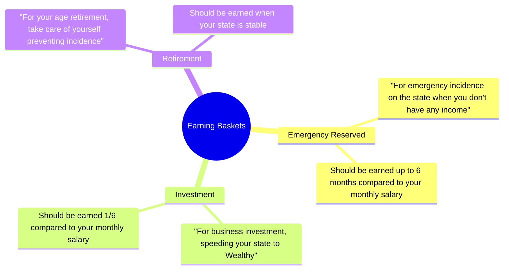

### #Earning

##### We should consider our **`Earning`** by knowing the 3 important concepts


## #The-way-to-become-Wealthy

##### First step is have "Insight", look to yourself, *"You are, What you think"*

```merm
%%{init: { 'themeVariables': { 'fontSize': '10px', 'fontFamily': 'Inter'}}}%%

graph TD;
  A(Make More);
  B(Speed Wisely);
  C(Save More);

  A --> B;
  B --> C;
```
1. **The Wrong and the True step that make people thinks that make them "Wealthy"**

| Wrong                                                                                                  | True                                                                                                                                                                                                                                                                |
| ------------------------------------------------------------------------------------------------------ | ------------------------------------------------------------------------------------------------------------------------------------------------------------------------------------------------------------------------------------------------------------------- |
| ![[Pasted image 20240306113421.png]]                                                                   | ![[Pasted image 20240306113504.png]]                                                                                                                                                                                                                                |
| The wrong is people usually think that **they need to Make More money to become Wealthy (Outside-in)** | But actually **They must give importance to `Speed Wisely` first** because human have ability to take **Move their expenses to match the income.** So we should fixed the root problem first and start with this we can easier control out money to get **Wealthy** |

