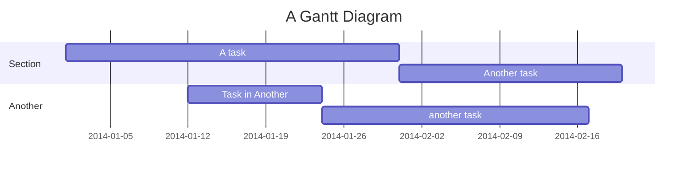

#### #Follow-the-PDCA-Guide-Plan-Do-Check-Action 


	PDCA is an concept for handle Expense and Income (E/I) in "Diary Day" to make sure you can control your monthly E/I

```merm
%%{init: { 'themeVariables': { 'fontSize': '10px', 'fontFamily': 'Inter'}}}%%
stateDiagram
direction LR
  Plan --> Do
  Do --> Check
  Check --> Action
  Action --> Plan

  state Plan {
    [*] --> TotalBudget
    TotalBudget --> Analyize
    Analyize --> PlanDiaryBudget
  }

  state Do {
    [*] --> ImplementPlan
    ImplementPlan --> MonitorProgress

  }

  state Check {
    [*] --> EvaluateResults
    EvaluateResults --> AnalyzePerformance
    AnalyzePerformance --> IdentifyIssues

  }

  state Action {
    [*] --> AdjustPlan
    AdjustPlan --> ImplementChanges
    ImplementChanges --> MonitorImpact
  }

```

### #E/I-Constructor

	For planing our E/I constructor we can know how trend for our E/I would go in direction, Which can be describe below this

```code
block-beta
  columns 6
  a["Income"]:2 b["Saving"]:1 c["Fixed Expensed"]:1 d["Variable Expensed"]:1 e["remaining
"]:1
  f["Saraly,Comission,Bonus etc."]:2 g["10% from Income"]:1 h["Obligation costs (Tax, Internet etc.)"]:1 i["Cost that don't fixed (Food, Travel)"]:1 
```

![[Pasted image 20240306145513.png]]


