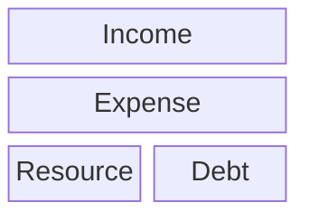

### #Finance-Relationship

	 Know the diffrents between these kind of finance 
	 "Passive Resource Income" will increase more Income
	 "Debt" will increase more expense

|                                      | Income                  | Expense                                               | Resource                            | Debt                           |
| ------------------------------------ | ----------------------- | ----------------------------------------------------- | ----------------------------------- | ------------------------------ |
| ![[Pasted image 20240308233447.png]] | - Rent - Profit - | -    Home instalment - Education instalment  | - Business - Deposit - Stocks | - Home Debt - Eduction Debt |

- From the diagram, you would see the relation between **Resource** and **Debt**, 
- Overall, the people who earned their **Resource**. They would have more **Income**. And people who earned **Debt** .They would have more Expense.

	But if you need to **Debt**, There are way to resolve this problem while nor effected you finance much
	Which is **Make the resource before you made debt**

#### #Make-the-Resource-before-made-Debt

	Is how you have resources that can be paid for debts which can be diagram following

| Financial status Diagram             |
| ------------------------------------ |
| ![[Pasted image 20240308235457.png]] |
| **Wealthy status Diagram**           |
| ![[Pasted image 20240308235941.png]] |
