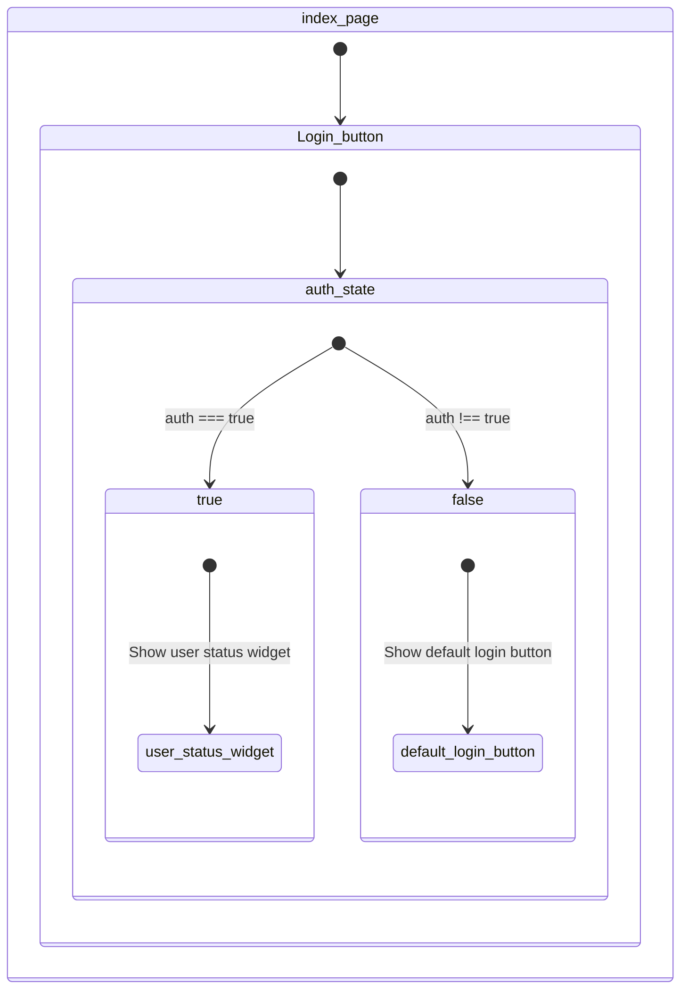
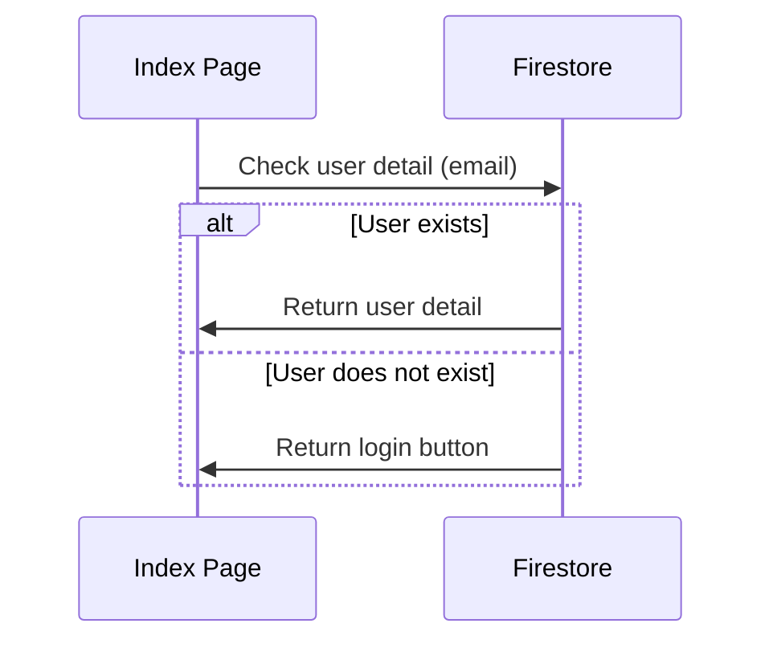

**User**
- "dashboard/payment-receipt-submisson" and "dashboard/parent-permission-submission"
- Info Register Form
	~~*- Fixed **age** value can't be **negative*** 0~~
	- ~~Disable required fields for these input 0~~
	  ![[Pasted image 20231205235812.png]]

Admin
- None
- UI
Most bugs come from under md-screen or iPad device 
	- ~~z-index on dropdown menu on under sm screen is behind the context (only for BoardTemplate component)~~  (TEMP: just fixed so it can barely see the dropdown menu but not fully visible) 1
	- ~~overflowing image outer login card under sm screen~~ 1 
	- container had overflowing (seems overflowing) on screen when only under md screen (Ipad) in main page 1 
		- **cause** -> Index, About and Learning Section
	- ~~above md-screen. when viewing on tablet device the Facebook and TikTok widgets do not show **causing** the non-balance for the elements~~  1
		- set justify between on contract section
	- ~~*height screen do not fit the container on "/dashboard/public-relations-board"*~~ 1
	~~*- adjust name and school head table and context table had more wide for easier to read*  1~~
	- ~~notification list~~ 
		- ![[Pasted image 20231206103523.png]] 
	*- TikTok Phone frame on footer is overflow on container under tablet device screen* - 2
		- Hidden on tablet and mobile device
	*- Swapped route navigated on admin dashboard*
		หน้าต่างสมัครควรเน้นคำให้เด่น อาจเพิ่มหมายเหตุเมื่อสมัครแล้ว… - 2
		- Extended Topic on each login/signup widget
		*โชว์สถานะควรอยู่หน้าสุด กดเข้าได้เลย ไม่ต้องล็อกอิน* - 2
		  - Flowchart

		  - On index page on Login button will depend on auth state
		  - if `auth === true` -> show user status widget
		  - otherwise -> show default login button
- **Solve**: Implement on UserDetailWidget
-
	  - *ควรใช้คำว่าสมัคร คำว่าเข้าร่วมมันกำกวม * - 2 
	  - โชว์ข้อมูล โรงเรียน สถานะการชำระเงิน - 2
		  - Implement on UserDetailWidget
	  - *หน้าเว็บวันที่ยังคงผิดอยู่*  - 2
	  - *นับเค้าดาวน์วันสมัคร*  - 2
		  - Changed Countdown from till 8 to 10 Feb
	  - *ทำวันเวลาให้ใหญ่ขึ้น ให้เด่น* - 2 
	  - *ใส่ข้อมูลให้เด่น บางคนไม่เลื่อนลง คนไม่ค่อยอ่านกัน* - 2
		  - Swapped component between (Sort the most important)
	- *Changed evidence image preview to lasted version* -2  
		    
Components
	- *UserDetailWidget implement* - 2
		- UI
			- should show UserData included
				- Name
				- Nickname
				- School
				- Evidences Tracking
				- Size Shirt
		- Function 
			- implement action for checking user detail by checking `email` input via firestore on `users` collection
			- Flowchart

**BACKEND**
- Shows file selection when user input relative path or URL directly
  ![[Pasted image 20231206000504.png]]
- **Cause** -> Since this bug had exploit the file selection which will be causing problem when we navigated to "/auth-as-admin". The Admin authentication so we can't accessing to "/admin-dashboard" and features for admin
- **Solve** (TEMP will be removed in the feature if the root problem had fixed)
	 - 