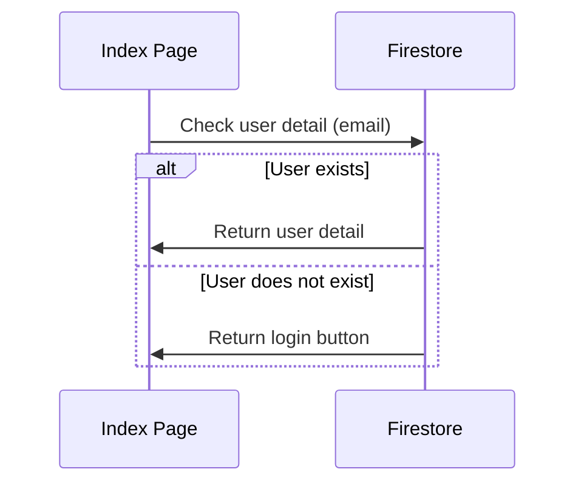

**1.0.8**
**Schema collection changed** - 0
	- **Users**
	- add `config` object on `users` collection
		- add `lateEvidenceSubbmited` as `object`
			- add `timestampAfterChecked: Timestamp` default as `null`
*Late sent documents* - 0
	- send **notification** and **contact email** to alert the user before the deadline one day
	- filter users who didn't send their documents over the deadline.
	**Implemented workflow**
	- flow chart
	```mermaid
	graph LR
	A[Start process] --> B{On action had triggered}
	B --> C[Filter users that submitted late]
	C --> D[lateEvidenceUsersSent.config.lateEvidenceSubbmited.timestampAfterChecked == null]
	D -- Yes --> E[Assign value for these lateEvidenceUsersSent on users collection -> config.lateEvidenceSubbmited.timestampAfterChecked]
	D -- No --> F[(lateEvidenceUsersSent.config.lateEvidenceSubbmited.timestampAfterChecked < Timestamp + next 3 days)]
	F -- Yes --> G[Sending alert message to notification and contact email]
	E --> G
	G --> H[End process]
	```
	
	- UI
		- add button event listener for calling function to trigger the event
	- Event
		- **start process**
		- on action had triggered
		- Filter users that submitted late -> on variable *lateEvidenceUsersSent* by
			- checking that their had not sent all evidences
		- if `lateEvidenceUsersSent.config.lateEvidenceSubbmited.timestampAfterChecked` === `null`
			- then -> assign value for these *lateEvidenceUsersSent* on **users** collection -> `conifg.lateEvidenceSubbmited.timestampAfterChecked` to **next 3 days**
		if (`lateEvidenceUsersSent.config.lateEvidenceSubbmited.timestampAfterChecked` < `Timestamp.now() + next 3 days`) 
					- then -> sending alert message to **notification** and **contact email** 
			- **end process**
*Implement* **Mail Service (MailGrid)** - 0
*Send back notification to all users and mark as `readed`* - 1
	Automatically sent **notification** and **contact email** when Admin approved "read" checkbox 
*Auto-filled template for `Notification Sender`* - 1
	Failed Checker
	
Components
	- *UserDetailWidget implement* - 2
		- UI
			- should show UserData included
				- Name
				- Nickname
				- School
				- Evidences Tracking
				- Size Shirt
		- Function 
			- implement action for checking user detail by checking `email` input via firestore on `users` collection
			- Flowchart - 2


**1.0.9**
