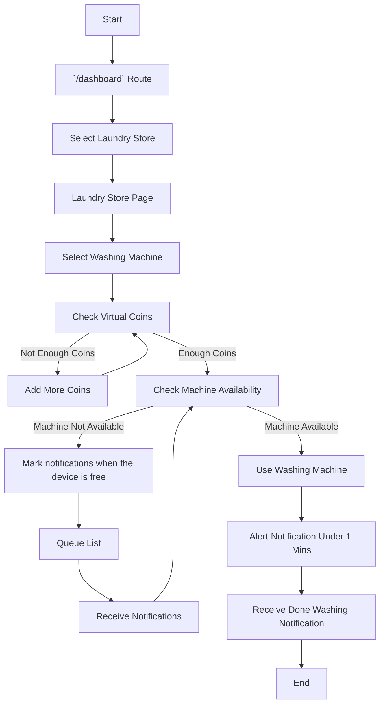

Routes & Pages
- route: `/` -> Index route for landing page
- route: `/dashboard` -> rendering Map for tracking laundry stores.
	- `/dashboard/[store-id]` -> child route for rendering laundry store data including washing machines

**Note**
For a better understanding of the workflow app, here is the detail.
- on route `/dashboard` when the page had started. It will randomly generate `7 LaundryStore` including `10 Washing Machine` on a random location under the `User location` radius.
- For **Reserve notification when washing machine is available** feature testing environment. Since Users can't reserve machines that they already used. So when the application starts it will also automatically randomly use 5 Washing machines in each store.  
(this is a keep-alive route it will only run once for the random generate script) 

**Features**
1. Implemented **Queue list** to show washing machine that had been on queue right now
   - Enable users to receive notifications when it's their turn to use a machine.
2. Implemented **Map** for
   - Show  laundry automation stores on the map (randomly put markdown on the map)
   - Show the queue list of each washing machine point 
   - Show animation on each laundry automation store when the client is using it
3. Smart notifications: Send alerts to customers when their laundry is finished, when a machine becomes available, or if there are any issues with their machines.
4. Implement **Form validation**
5. **Virtual coins** for using washing machine
	-  If the user doesn't have enough coins user can't use the washing machine 
	-  User can add more coins
	-  **Form validation** for coins
6. Implement **Notification** 
	- User can see their notification list.
	- Enable users to receive notifications when it's their turn to use a machine.
	- Receive a message when the washing machine going to be done in under 1 minute.
7.  Implemented **Machine available receive notifications:** Allow users to receive notifications on specific machines in advance when the machine is ready to use, especially for high-demand times or machines with special features.
8. Implemented **Washing Machine**


Flowchart


**Programming Design Pattern: Mixing Paradigms**
**Definition**: using OOP for the main roles and FP for secondary or supporting to design a system This approach leverages the strengths of both paradigms to create a more modular and maintainable codebase.

**Main Roles**
```TS
export class WashingMachine implements IWashingMachine {
  public id: string
  public storeId: string
  public name: string
  public isAvailable: boolean = true
  public isBooked: boolean = false

  public fromTime: number = 0
  public timeLeft: number = 0
  private timeInterval: NodeJS.Timeout

  constructor(id: string, storeId: string, name: string) {
    // Constructor for the WashingMachine class
  }

  startWashing(
    second: number,
    storeQueue: QueueOperation,
    user: User | null,
    store: LaundryStore
  ): void {
    // This method starts the washing process. It sets the machine as unavailable,
    // sets the time left for the washing process, and adds the machine to the store queue.
    // If a user is provided, it also adds the machine to the user's queue and starts the time left interval.
  }

  onBooked(user: User) {
    // This method is called when the machine is booked. It sets the machine as booked,
    // and if there is time left for the washing process, it starts an interval that checks
    // the time left every second and sends notifications to the user when necessary.
  }

  setTimeLeftInterval(user: User | null): void {
    // This method starts an interval that checks the time left for the washing process every second.
    // If there is time left, it decreases the time left by one. If the time left is 60 seconds,
    // it sends a notification to the user. If there is no time left, it sends a success notification
    // to the user, clears the interval, and resets the fromTime property.
  }

  getTimeLeftInterval(): number {
    // This method returns the time left for the washing process.
  }
}
```


```TS
export class User implements IUser {
  uId: string
  username: string
  balance: VirtualCoins
  currentLocation: ICoordinates
  queueList: QueueOperation[]

  constructor(username: string, initialCoins: number, location: ICoordinates) {
    // Constructor for the User class. It initializes the user ID, username, balance, current location, and queue list.
  }

  getVirtualCoins(): number {
    // This method returns the current balance of the user's virtual coins.
  }

  addVirtualCoins(amount: number) {
    // This method adds the provided amount to the user's balance of virtual coins.
  }

  addQueue(store: LaundryStore, machine: WashingMachine) {
    // This method adds a machine to the user's queue. If the store is already in the queue list, it adds the machine to the existing queue.
    // Otherwise, it creates a new queue for the store and adds the machine to the new queue.
  }

  getAllReserveQueue(allQueue: QueueOperation[]): IQueue[] {
    // This method returns all the queues that have at least one machine booked.
  }

  useWashingMachine(
    machine: WashingMachine,
    cost: number,
    mins: number,
    storeQueue: QueueOperation,
    store: LaundryStore
  ): boolean {
    // This method allows the user to use a washing machine. If the user has enough balance, it deducts the cost from the user's balance,
    // starts the washing process, and returns true. Otherwise, it returns false.
  }
}
```

```TS
class QueueOperation implements IQueueOperations {

store: LaundryStore

machinesOnQueue: WashingMachine[] = []

constructor(storeId: LaundryStore, machinesOnQueue: WashingMachine[]) {

// Constructor for the QueueOperation class. It initializes the store and the list of machines on the queue.

}

enqueue(machine: WashingMachine) {

// This method adds a machine to the queue.

}

dequeue(machineToDequeued: WashingMachine, onDequeueUserQueueList?: { user: User }) {

// This method removes a machine from the queue. If a user is provided and the user's queue for the store is empty after the dequeue operation,

// it also removes the queue from the user's queue list.

}
getQueue(): WashingMachine[] {

// This method returns the list of machines on the queue.

}
}```

```TS
interface Coordinates {
  latitude: number;
  longitude: number;
}

export class LaundryStore implements ILaundryStore {
  id: string
  name: string
  location: ICoordinates

  constructor(id: string, name: string, location: ICoordinates) {
    // Constructor for the LaundryStore class. It initializes the id, name, and location.
  }

  getStore() {
    // This method returns the store as an object with the id, name, and location.
  }
}
```

```TS
export class VirtualCoins implements IVirtualCoins {
  balance: number = 0

  constructor(balance: number) {
    // Constructor for the VirtualCoins class. It initializes the balance with the provided value.
  }

  addCoins(amount: number) {
    // This method adds the provided amount to the balance.
  }

  getBalance(): number {
    // This method returns the current balance.
  }
}
```

```TS
export class Notification implements INotification {
  public user: User // Assuming you have a User class
  public message: string
  public date: Date
  public machine?: WashingMachine

  constructor(user: User, message: string, machine?: WashingMachine) {
    // Constructor for the Notification class. It initializes the user, message, machine (if provided), and date.
  }

  getNotificationAsMessage() {
    // This method returns the notification as an object with the message and date.
  }
}
```

The order can be see in code.