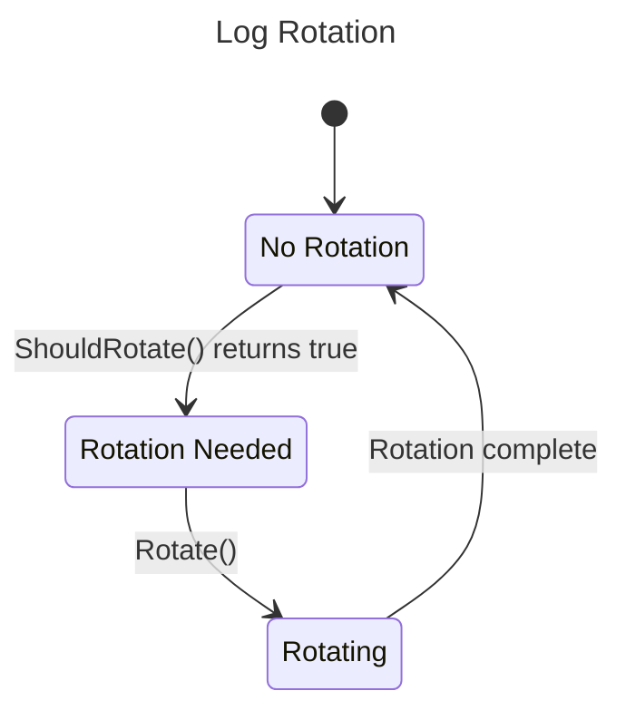
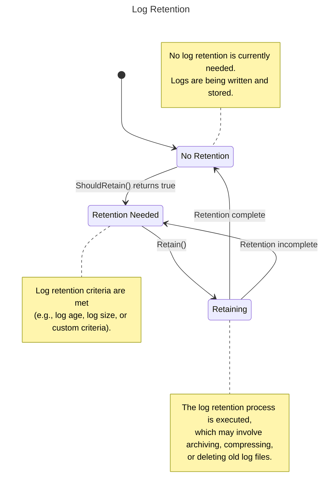

[[Go Lectures]] #Go-Core #Go-Concept #Go-Package 

**Content**
#Logger-Architecture
#Log-Rotation-Retention
	#Log-Rotation
	#Log-Retention
#Log-Usage

Go standard library provides straightforward tools for outputting logs from Go programs, with the [log](https://pkg.go.dev/log) package for free-form output and the [log/slog](https://pkg.go.dev/log/slog) package for structured output.

Check out [[Logging]] for how to implemented custom logger following the logger's architecture

## Logger Workflow and Architecture 
#Logger-Architecture 


```merm
classDiagram
    Logger *-- LogLevel
    Logger *-- LogWriter
    Logger *-- LogFormatter
    Logger *-- LogFilter
    Logger *-- LogRotation
    Logger : +Log(level, message)
    Logger : +SetLevel(level)
    Logger : +SetWriter(writer)
    Logger : +SetFormatter(formatter)
    Logger : +AddFilter(filter)
    Logger : +SetRotation(rotation)

    LogLevel : +DEBUG
    LogLevel : +INFO
    LogLevel : +WARNING
    LogLevel : +ERROR
    LogLevel : +FATAL

    LogWriter : +WriteLog(entry)

    LogFormatter : +Format(entry)

    LogFilter : +Filter(entry)

    LogRotation : +ShouldRotate(entry)
    LogRotation : +Rotate()

    class Logger {
        <<struct>>
    }

    class LogLevel {
        <<int>>
    }

    class LogWriter {
        <<interface>>
    }

    class LogFormatter {
        <<interface>>
    }

    class LogFilter {
        <<interface>>
    }

    class LogRotation {
        <<interface>>
    }
```
- **Logger Architecture**
	class diagram provides an overview of the logger's architecture, including the main `Logger` struct and its relationships with various components like `LogLevel`, `LogWriter`, `LogFormatter`, `LogFilter` and `LogRotation`.
	- `Logger` is the central struct that encapsulates the logging functionality. It has methods like `Log` to log messages, `SetLevel` to set the log level, `SetWriter` to configure the log writer, `SetFormatter` to set the log formatter, `AddFilter` to add log filters, and `SetRotation` to set up log rotation.
	- `LogLevel` is an integer type representing different log levels, such as `DEBUG`, `INFO`, `WARNING`, `ERROR`, and `FATAL`. Log levels help categorize log messages based on their severity or importance.
	- `LogWriter` is an interface that defines the `WriteLog` method. This interface is implemented by concrete log writer types (e.g., `FileWriter`, `ConsoleWriter`, `NetworkWriter`) that handle writing log entries to different destinations like files, consoles, or network sockets.
	- `LogFormatter` is an interface that defines the `Format` method. It is implemented by concrete log formatter types (e.g., `JSONFormatter`, `TextFormatter`) that determine how log entries are formatted before being written.
	- `LogFilter` is an interface that defines the `Filter` method. It is implemented by concrete log filter types (e.g., `LevelFilter`, `PackageFilter`) that decide whether a log entry should be processed or filtered out based on certain criteria.
	- `LogRotation` is an interface that defines the `ShouldRotate` and `Rotate` methods. It is implemented by concrete log rotation types (e.g., `SizeRotation`, `AgeRotation`) that determine when log files should be rotated and handle the rotation process.
	
	The relationships between the `Logger` struct and these components are represented using composition (solid lines with diamonds). This design allows for flexibility and extensibility, as different implementations of log writers, formatters, filters, and rotation handlers can be plugged into the logger.


```merm
sequenceDiagram
    participant App
    participant Logger
    participant LogFilter
    participant LogFormatter
    participant LogWriter
    participant LogRotation

    App->>Logger: Log(level, message)
    Logger->>LogFilter: Filter(entry)
    alt if entry passes filter
        LogFilter-->>Logger: 
        Logger->>LogFormatter: Format(entry)
        LogFormatter-->>Logger: formattedEntry
        Logger->>LogWriter: WriteLog(formattedEntry)
        LogWriter->>LogRotation: ShouldRotate(formattedEntry)
        alt if rotation needed
            LogRotation-->>LogWriter: 
            LogRotation->>LogRotation: Rotate()
        else no rotation
        end
        LogWriter-->>Logger: 
    else entry filtered out
        LogFilter-->>Logger: 
    end
    Logger-->>App: end
```
- **Logging Workflow**
	This diagram illustrates the sequence of interactions and control flow that occurs when logging a message.
	
	1. The application calls the `Log` method on the `Logger` struct, passing the log level and message.
	2. The `Logger` invokes the `Filter` method on the configured `LogFilter` instances, passing the log entry.
	3. If the log entry passes the filter(s), the `Logger` calls the `Format` method on the configured `LogFormatter` to format the log entry.
	4. The `Logger` then calls the `WriteLog` method on the configured `LogWriter` instance, passing the formatted log entry.
	5. The `LogWriter` invokes the `ShouldRotate` method on the configured `LogRotation` instance to check if log rotation is needed.
	6. If log rotation is needed, the `LogWriter` calls the `Rotate` method on the `LogRotation` instance to perform the rotation process.
	7. After writing the log entry (and potentially rotating the logs), the control flow returns to the application.

## Log Rotation and Retention
#Log-Rotation-Retention 
- Log Rotation and Retention is a process and feature in Go logging system that manages the size and lifespan of log files. **Log Rotation** involves creating new log files once the current file reaches a certain size limit, while **Log Retention** deals with deleting older logs after a certain period or when storage limit is reached. This prevents log files from growing indefinitely and consuming all available disk space.

**Log Rotation**
	#Log-Rotation
	This state diagram focuses specifically on the log rotation process, showing the different states involved (no rotation, rotation needed, and rotating) and the transitions between them.


- **Log Retention**
	1. **No Retention**: This is the initial state where no log retention is currently needed. Logs are being written and stored as usual.
	2. **Retention Needed**: When the `ShouldRetain` method (or a custom retention criteria check) returns `true`, the state transitions to "Retention Needed." This indicates that the log retention criteria have been met, such as logs reaching a certain age or size, or based on custom criteria.
	3. **Retaining**: From the "Retention Needed" state, the `Retain` method is called, which transitions the state to "Retaining." During this state, the log retention process is executed. This may involve archiving or compressing old log files, or deleting them altogether, depending on the retention strategy implemented.
	4. **Transitions**:
	    - If the retention process completes successfully, the state transitions back to "No Retention."
	    - If the retention process is incomplete (e.g., due to an error or partial completion), the state transitions back to "Retention Needed" to retry the retention process later.

	The notes on the diagram provide additional context and explanation for each state:
	
	- **No Retention**: Logs are being written and stored as usual, with no retention needed.
	- **Retention Needed**: The log retention criteria have been met, indicating that log retention is required.
	- **Retaining**: The log retention process is being executed, which may involve archiving, compressing, or deleting old log files.

```go
package main

import (
    "bytes"
    "fmt"
    "log"
    "os"

    "log/slog"
)

func main() {

    log.Println("standard logger")

    log.SetFlags(log.LstdFlags | log.Lmicroseconds)
    log.Println("with micro")

    log.SetFlags(log.LstdFlags | log.Lshortfile)
    log.Println("with file/line")

    mylog := log.New(os.Stdout, "my:", log.LstdFlags)
    mylog.Println("from mylog")

    mylog.SetPrefix("ohmy:")
    mylog.Println("from mylog")

    var buf bytes.Buffer
    buflog := log.New(&buf, "buf:", log.LstdFlags)

    buflog.Println("hello")

    fmt.Print("from buflog:", buf.String())

    jsonHandler := slog.NewJSONHandler(os.Stderr, nil)
    myslog := slog.New(jsonHandler)
    myslog.Info("hi there")

    myslog.Info("hello again", "key", "val", "age", 25)
}
```

```bash
2023/08/22 10:45:16 standard logger
2023/08/22 10:45:16.904141 with micro
2023/08/22 10:45:16 logging.go:40: with file/line
my:2023/08/22 10:45:16 from mylog
ohmy:2023/08/22 10:45:16 from mylog
from buflog:buf:2023/08/22 10:45:16 hello
{"time":"2023-08-22T10:45:16.904166391-07:00",
 "level":"INFO","msg":"hi there"}
{"time":"2023-08-22T10:45:16.904178985-07:00",
    "level":"INFO","msg":"hello again",
    "key":"val","age":25}
```