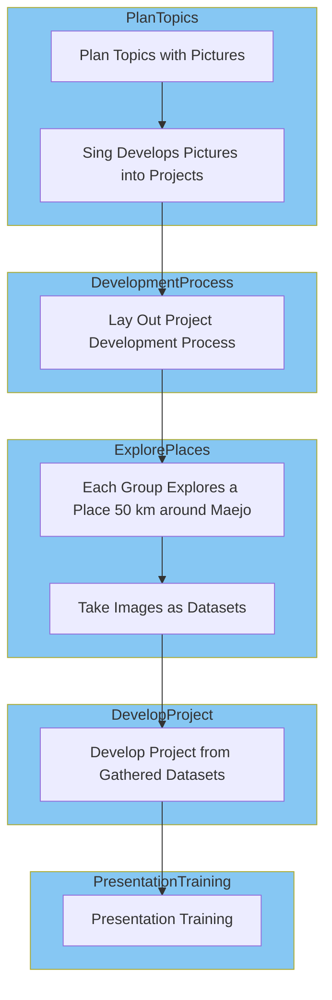

![[กำหนดการ-ทางการ.pdf]]

What type of dataset can be gathered that can be lead to project
How can we limit developing time

กำหนดการพุ่งนี้

```mermaid
graph TD

    subgraph PlanTopics
        a[Plan Topics with Pictures]
        b[Sing Develops Pictures into Projects]
    end

    subgraph DevelopmentProcess
        c[Lay Out Project Development Process]
    end

    subgraph ExplorePlaces
        d[Each Group Explores a Place 50 km around Maejo]
        e[Take Images as Datasets]
    end

    subgraph DevelopProject
        f[Develop Project from Gathered Datasets]
    end

    subgraph PresentationTraining
        g[Presentation Training]
    end

    a --> b
    b --> c
    c --> d
    d --> e
    e --> f
    f --> g

    style PlanTopics fill:#86C7F3
    style DevelopmentProcess fill:#86C7F3
    style ExplorePlaces fill:#86C7F3
    style DevelopProject fill:#86C7F3
    style PresentationTraining fill:#86C7F3

```
