[[Linux Contents]]

## Contents
1. Basic Commands We Should Know
2. ลักษณะการใช้งาน Command แต่ละอัน
3. Labs

## Mindmap หมวดหมู่ของ Command

```mermaid
mindmap
  root(คำสั่ง Linux)
    ระบบไฟล์
      whoami => "แสดงชื่อผู้ใช้งาน"
      pwd => "แสดงเส้นทางไดเรกทอรีปัจจุบัน"
      ls => "แสดงรายการไฟล์และไดเรกทอรี"
      cd => "เปลี่ยนไดเรกทอรีปัจจุบัน"
      mkdir => "สร้างไดเรกทอรีใหม่"
      rm => "ลบไฟล์หรือไดเรกทอรี"
      mv => "ย้ายหรือเปลี่ยนชื่อไฟล์/ไดเรกทอรี"
      cp => "คัดลอกไฟล์หรือไดเรกทอรี"
      find => "ค้นหาไฟล์ในระบบ"
      cat => "แสดงเนื้อหาไฟล์"
      tail/head => "แสดงบรรทัดสุดท้าย/แรก"
    
    ระบบและบริการ  
      sudo => "ทำงานด้วยสิทธิ์ผู้ดูแลระบบ"
      apt/yum => "จัดการแพ็กเกจซอฟต์แวร์"
      systemctl => "ควบคุมบริการระบบต่างๆ"
      service/systemctl => "เริ่ม หยุด จัดการบริการ"
      
    การจัดการโปรเซส
      ps => "แสดงโปรเซสที่ทำงานอยู่"  
      kill => "หยุดโปรเซส"
      
    แก้ไขข้อความ
      vim/nano => "แก้ไขข้อความในไฟล์"
      
    ระบบเครือข่าย
      hostname => "แสดงชื่อเครื่องคอมพิวเตอร์"
      ip/ifconfig => "ตั้งค่าและแสดงการกำหนดค่าเน็ตเวิร์ก"
      netstat/ss => "แสดงการเชื่อมต่อเน็ตเวิร์ก"  
      ping => "ทดสอบการเชื่อมต่อเน็ตเวิร์ก"
      ssh => "เข้าสู่ระบบเครื่องอื่นผ่านเครือข่าย"
```

ความหมายแบบละเอียดและอธิบายการใช้งานคำสั่ง Linux ต่างๆ เป็นภาษาไทย ดังนี้

| คำสั่ง                | คำอธิบายภาษาไทย                                                                                 |
| --------------------- | ----------------------------------------------------------------------------------------------- |
| `whoami`              | แสดงชื่อผู้ใช้งานปัจจุบัน คำสั่งนี้ใช้เพื่อตรวจสอบว่าคุณกำลังใช้งานด้วยบัญชีผู้ใช้งานอะไร       |
| `hostname`            | แสดงชื่อของเครื่องคอมพิวเตอร์ที่คุณกำลังใช้งานอยู่ ใช้เพื่อตรวจสอบว่ากำลังใช้งานอยู่บนเครื่องใด |
| `pwd`                 | แสดงเส้นทางของไดเรกทอรีปัจจุบันที่คุณกำลังทำงานอยู่ ใช้เพื่อตรวจสอบว่าคุณอยู่ในไดเรกทอรีใด      |
| `ls`                  | แสดงรายการไฟล์และไดเรกทอรีที่อยู่ในไดเรกทอรีปัจจุบัน ใช้เพื่อดูว่ามีอะไรบ้างในไดเรกทอรีนั้น     |
| `cd`                  | เปลี่ยนไดเรกทอรีปัจจุบันไปยังไดเรกทอรีอื่น เช่น `cd /home/user` เพื่อเปลี่ยนไปที่ไดเรกทอรีโฮม   |
| `mkdir`               | สร้างไดเรกทอรีใหม่ เช่น `mkdir project` เพื่อสร้างไดเรกทอรีชื่อ project                         |
| `rm`                  | ลบไฟล์หรือไดเรกทอรี ต้องระวังเพราะไม่สามารถคืนค่าได้                                            |
| `mv`                  | ย้ายหรือเปลี่ยนชื่อไฟล์หรือไดเรกทอรี เช่น `mv file.txt newname.txt`                             |
| `cp`                  | คัดลอกไฟล์หรือไดเรกทอรี เช่น `cp file.txt /backups/`                                            |
| `find`                | ค้นหาไฟล์ในไดเรกทอรีและไดเรกทอรีย่อย เช่น `find . -name *.txt`                                  |
| `sudo`                | ให้สิทธิ์ผู้ดูแลระบบ (root) ในการรันคำสั่ง ใช้เมื่อต้องการทำสิ่งที่ต้องใช้สิทธิ์พิเศษ           |
| `apt`/`yum`           | เครื่องมือจัดการแพ็กเกจสำหรับติดตั้ง ลบ หรืออัปเดตโปรแกรมต่างๆ                                  |
| `systemctl`           | ควบคุมการเริ่มต้น หยุด หรือรีสตาร์ทการทำงานของบริการระบบต่างๆ                                   |
| `ip`/`ifconfig`       | กำหนดค่าหรือแสดงข้อมูลการตั้งค่าเน็ตเวิร์กบนเครื่อง                                             |
| `netstat`/`ss`        | แสดงข้อมูลการเชื่อมต่อเน็ตเวิร์กและสถิติต่างๆ                                                   |
| `ping`                | ทดสอบการเชื่อมต่อเน็ตเวิร์กกับเครื่องอื่นๆ                                                      |
| `ssh`                 | เชื่อมต่อและควบคุมเครื่องคอมพิวเตอร์อื่นผ่านระบบเน็ตเวิร์กแบบปลอดภัย                            |
| `ps`                  | แสดงรายการโปรเซสที่กำลังทำงานบนระบบ                                                             |
| `kill`                | หยุดการทำงานของโปรเซสที่ระบุ                                                                    |
| `vim`/`nano`          | โปรแกรมแก้ไขข้อความ ใช้สำหรับการแก้ไขไฟล์ต่างๆ                                                  |
| `cat`                 | แสดงเนื้อหาภายในไฟล์ทั้งหมด                                                                     |
| `tail`/`head`         | แสดงบรรทัดสุดท้ายหรือบรรทัดแรกของไฟล์                                                           |
| `service`/`systemctl` | เริ่ม หยุด หรือจัดการบริการระบบต่างๆ                                                            |

## แนวทางการใช้งาน หรือ ลักษณะการใช้งาน Command แต่ละอัน

`whoami`

- วิธีใช้: พิมพ์คำสั่ง `whoami` ในเทอร์มินัลหรือคอนโซลของ Linux แล้วกด Enter
- ใช้ในสถานการณ์: เมื่อคุณต้องการตรวจสอบว่าตอนนี้คุณกำลังใช้งานด้วยบัญชีผู้ใช้งานอะไร ซึ่งจะเป็นประโยชน์เมื่อต้องทำงานที่ต้องใช้สิทธิ์พิเศษ

`hostname`

- วิธีใช้: พิมพ์คำสั่ง `hostname` แล้วกด Enter
- ใช้ในสถานการณ์: เมื่อคุณต้องการดูชื่อของเครื่องคอมพิวเตอร์ที่คุณกำลังใช้งานอยู่ ซึ่งจะเป็นประโยชน์เมื่อต้องทำงานกับหลายๆ เครื่องในเครือข่าย

`pwd`

- วิธีใช้: พิมพ์คำสั่ง `pwd` แล้วกด Enter
- ใช้ในสถานการณ์: เมื่อคุณต้องการดูว่าตอนนี้คุณกำลังอยู่ในไดเรกทอรี (โฟลเดอร์) ใด ซึ่งจะช่วยให้ง่ายต่อการนำทางในระบบไฟล์

`ls`

- วิธีใช้: พิมพ์คำสั่ง `ls` แล้วกด Enter เพื่อดูไฟล์และโฟลเดอร์ในไดเรกทอรีปัจจุบัน หรือใช้ `ls /path/to/directory` เพื่อดูในไดเรกทอรีอื่น
- ใช้ในสถานการณ์: เมื่อคุณต้องการดูว่ามีอะไรบ้างในไดเรกทอรีนั้น เช่น ไฟล์หรือโฟลเดอร์ย่อย

`cd`

- วิธีใช้: พิมพ์คำสั่ง `cd path/to/directory` เพื่อเปลี่ยนไปยังไดเรกทอรีที่ต้องการ เช่น `cd /home/user/Documents`
- ใช้ในสถานการณ์: เมื่อคุณต้องการเปลี่ยนไดเรกทอรีปัจจุบันไปยังไดเรกทอรีอื่น เพื่อทำงานกับไฟล์ในไดเรกทอรีนั้น

`mkdir`

- วิธีใช้: พิมพ์คำสั่ง `mkdir directory_name` เพื่อสร้างไดเรกทอรีใหม่
- ใช้ในสถานการณ์: เมื่อคุณต้องการสร้างโฟลเดอร์ใหม่เพื่อจัดระเบียบไฟล์ของคุณ

`rm`

- วิธีใช้: พิมพ์คำสั่ง `rm file_name` เพื่อลบไฟล์ หรือ `rm -r directory_name` เพื่อลบไดเรกทอรีและทุกอย่างภายในนั้น
- ใช้ในสถานการณ์: เมื่อคุณต้องการลบไฟล์หรือโฟลเดอร์ที่ไม่ต้องการแล้ว แต่ต้องระวังเพราะไม่สามารถคืนค่าได้หลังจากลบแล้ว

`mv`

- วิธีใช้: พิมพ์คำสั่ง `mv source destination` เช่น `mv file.txt /backups/` เพื่อย้ายไฟล์ หรือ `mv oldname.txt newname.txt` เพื่อเปลี่ยนชื่อไฟล์
- ใช้ในสถานการณ์: เมื่อคุณต้องการย้ายไฟล์หรือโฟลเดอร์ไปยังตำแหน่งอื่น หรือต้องการเปลี่ยนชื่อไฟล์หรือโฟลเดอร์

`cp`

- วิธีใช้: พิมพ์คำสั่ง `cp source destination` เช่น `cp file.txt /backups/` เพื่อคัดลอกไฟล์ไปยังตำแหน่งอื่น
- ใช้ในสถานการณ์: เมื่อคุณต้องการทำสำเนาไฟล์หรือโฟลเดอร์ไว้ที่อื่น เช่น สำรองข้อมูล หรือคัดลอกไปยังเครื่องอื่น

`find`

- วิธีใช้: พิมพ์คำสั่ง `find path/ -name pattern` เช่น `find . -name *.txt` เพื่อค้นหาไฟล์ที่มีนามสกุล .txt ในไดเรกทอรีปัจจุบันและไดเรกทอรีย่อย
- ใช้ในสถานการณ์: เมื่อคุณต้องการค้นหาไฟล์ในระบบ โดยสามารถกำหนดเงื่อนไขการค้นหาได้ เช่น ชื่อไฟล์ ขนาดไฟล์ วันที่สร้าง เป็นต้น

`sudo`

- วิธีใช้: พิมพ์คำสั่ง `sudo command` เช่น `sudo apt update` เพื่อรันคำสั่งด้วยสิทธิ์ของผู้ดูแลระบบ (root)
- ใช้ในสถานการณ์: เมื่อคุณต้องการทำงานที่ต้องใช้สิทธิ์พิเศษ เช่น ติดตั้งโปรแกรม แก้ไขการตั้งค่าระบบ ซึ่งผู้ใช้ทั่วไปไม่สามารถทำได้

`apt` / `yum`

- วิธีใช้: `apt` สำหรับ Ubuntu/Debian, `yum` สำหรับ CentOS/RHEL เช่น `apt install package_name` หรือ `yum install package_name`
- ใช้ในสถานการณ์: เพื่อติดตั้ง ลบ หรืออัปเดตโปรแกรมและแพ็กเกจซอฟต์แวร์ต่างๆ ในระบบ

`systemctl`

- วิธีใช้: `systemctl command service_name` เช่น `systemctl start apache2` เพื่อสั่งเริ่มบริการ Apache
- ใช้ในสถานการณ์: เพื่อควบคุมการทำงานของบริการระบบต่างๆ เช่น เว็บเซิร์ฟเวอร์ ฐานข้อมูล เป็นต้น โดยสามารถเริ่ม หยุด หรือรีสตาร์ทได้

`ip` / `ifconfig`

- วิธีใช้: `ip addr` หรือ `ifconfig` เพื่อดูข้อมูลการตั้งค่าเน็ตเวิร์กบนเครื่อง
- ใช้ในสถานการณ์: เมื่อคุณต้องการตรวจสอบหรือกำหนดค่าการตั้งค่าเน็ตเวิร์ก เช่น IP Address, Subnet Mask, Default Gateway

`netstat` / `ss`

- วิธีใช้: `netstat -tunlp` หรือ `ss -tunlp` เพื่อแสดงการเชื่อมต่อเน็ตเวิร์กและสถานะของพอร์ต
- ใช้ในสถานการณ์: เมื่อคุณต้องการดูว่ามีการเชื่อมต่อเน็ตเวิร์กอะไรบ้าง และรับหรือส่งข้อมูลผ่านพอร์ตใดบ้าง ซึ่งเป็นประโยชน์ในการแก้ปัญหาเน็ตเวิร์ก

`ping`

- วิธีใช้: พิมพ์คำสั่ง `ping hostname_or_ip` เช่น `ping google.com` หรือ `ping 8.8.8.8`
- ใช้ในสถานการณ์: เพื่อทดสอบการเชื่อมต่อระหว่างเครื่องของคุณกับเครื่องหรือเว็บไซต์อื่น ซึ่งเป็นประโยชน์ในการหาสาเหตุปัญหาเน็ตเวิร์ก

`ssh`

- วิธีใช้: พิมพ์คำสั่ง `ssh user@host` เช่น `ssh user@192.168.1.100` เพื่อเชื่อมต่อไปยังเครื่องอื่นผ่านพรอมพ์แบบปลอดภัย
- ใช้ในสถานการณ์: เมื่อคุณต้องการควบคุมหรือจัดการเครื่องคอมพิวเตอร์อื่นๆ ในระบบเครือข่ายจากระยะไกล ซึ่งเป็นวิธีการที่ปลอดภัยกว่าการเชื่อมต่อแบบธรรมดา

`ps`

- วิธีใช้: พิมพ์คำสั่ง `ps aux` เพื่อแสดงรายการโปรเซสที่กำลังทำงานบนระบบทั้งหมด
- ใช้ในสถานการณ์: เมื่อคุณต้องการดูว่ามีโปรแกรมหรือบริการใดบ้างที่กำลังทำงานอยู่บนเครื่อง ซึ่งเป็นประโยชน์ในการแก้ปัญหาหรือจัดการทรัพยากร

`kill`

- วิธีใช้: พิมพ์คำสั่ง `kill pid` เช่น `kill 1234` เพื่อหยุดการทำงานของโปรเซสที่มี Process ID เท่ากับ 1234
- ใช้ในสถานการณ์: เมื่อคุณต้องการบังคับปิดโปรแกรมหรือบริการที่ค้างหรือไม่ตอบสนอง ทำให้สามารถหลุดจากสถานการณ์นั้นได้

`vim` / `nano`

- วิธีใช้: พิมพ์คำสั่ง `vim file.txt` หรือ `nano file.txt` เพื่อเปิดไฟล์ขึ้นมาแก้ไขด้วยโปรแกรมแก้ไขข้อความแบบละเอียด
- ใช้ในสถานการณ์: เมื่อคุณต้องการแก้ไขไฟล์ข้อความหรือไฟล์กำหนดค่าต่างๆ ในระบบ Linux ซึ่งมีความยืดหยุ่นและฟังก์ชันการใช้งานมากกว่าการแก้ไขแบบง่ายๆ

`cat`

- วิธีใช้: พิมพ์คำสั่ง `cat file.txt` เพื่อแสดงเนื้อหาทั้งหมดของไฟล์นั้นในเทอร์มินัล
- ใช้ในสถานการณ์: เมื่อคุณต้องการดูเนื้อหาของไฟล์ทั้งหมด หรือต้องการรวมเนื้อหาของหลายๆ ไฟล์เข้าด้วยกัน

`tail` / `head`

- วิธีใช้: `tail -n 10 file.txt` เพื่อแสดง 10 บรรทัดสุดท้ายของไฟล์, `head -n 5 file.txt` เพื่อแสดง 5 บรรทัดแรกของไฟล์
- ใช้ในสถานการณ์: เมื่อคุณต้องการดูเพียงบางส่วนของไฟล์ ซึ่งเป็นประโยชน์ในการตรวจสอบไฟล์ log หรือไฟล์ขนาดใหญ่

`service` / `systemctl`

- วิธีใช้: `service service_name command` หรือ `systemctl command service_name` เช่น `service apache2 start` หรือ `systemctl start apache2`
- ใช้ในสถานการณ์: เพื่อเริ่ม หยุด หรือรีสตาร์ทบริการระบบต่างๆ เช่น เว็บเซิร์ฟเวอร์ ฐานข้อมูล ซึ่งเป็นวิธีควบคุมที่สะดวกกว่าการใช้คำสั่งโดยตรง

## Lab
- สามารถไปฝึกทำ Lab ฝึกการใช้ Linux Command ได้ที่เว็บไซต์ https://overthewire.org/wargames/bandit/
- Basic ที่ควรทำได้จะอยู่ในระดับ 0 ถึง 6 (สามารถนำ Command ในนี้ไปลองใช้ฝึกกันได้ 🥹)
- นอกเหนือจากนี้ไม่รับประกันความความง่ายนะครับ ใครอยากทำมากกว่านี้ก็ไปดูกันเอง อิอิ