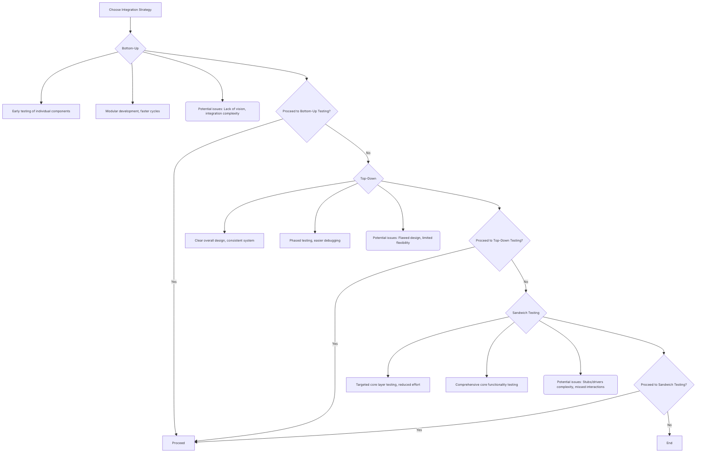

#### #Bottom-Up-Integration
	- starts with testing the lowest-level or most independent modules of a system and gradually integrates them with higher-level or more dependent modules
	- user-friendly, easy to observe, and compatible with object-oriented structure	  
**Pros:**
- **Early testing:** Catch bugs early in individual components.
- **Modular development:** Faster development cycles due to parallel work.
**Cons:**
- **Lack of overall vision:** Difficulty ensuring system coherence.
- **Integration challenges:** Combining numerous components can be complex.
#### #Top-Down-Integration-Testing
	- testing starts from the highest-level modules and then moves to the lower-level modules. 
	- It uses stubs to simulate the behavior of the lower-level modules that are not yet developed or tested.

**Pros:**
- **Clear vision:** Well-defined overall design ensures system consistency.
- **Phased testing:** Easier debugging and critical issue identification.
**Cons:**
- **Potential for errors:** Flawed initial design leads to costly rework.
- **Limited flexibility:** Difficult to adapt to changing requirements.

![[Pasted image 20240222135007.png]]

#### #Sandwich-Testing-Strategy
	combines elements of both bottom-up and top-down integration testing
**Pros:**
- **Targeted testing:** Focuses on the core layer, minimizing effort.
- **Granular approach:** Comprehensive testing of core functionality.
**Cons:**
- **Reliance on stubs and drivers:** Time-consuming to create and maintain.
- **Potential for missed interactions:** Might overlook issues outside the core layer.
  
  **Choosing the Right Approach:**
- **Bottom-up:** Good for fast-paced, flexible projects with modular design.
- **Top-down:** Suitable for structured projects with a clear overall vision.
- **Sandwich:** Ideal for complex systems with a distinct core layer requiring focused testing.

#### #Black-Box-Testing
	- the tester focuses on **the functionality of the software without any knowledge of its internal workings**.
	- you treat the software like a "black box" and only care about what goes in (inputs) and what comes out (outputs).
**Typical usage:**
- Acceptance testing by end users.
- Functional testing by QA testers.
- Usability testing by user experience specialists.
#### #Functional-Testing 
	- Tests the **intended functionality** of the software, ensuring it adheres to **specifications**.
	- Superset for "Black-Box Testing" since testing considers both user and intended functionality.
- **Typical usage:** All levels of testing (unit, integration, system, acceptance), regression testing.

**Key differences between Black-box and Functional:**
- **Perspective:** Black-box is purely user-centric, while functional testing considers both user and intended functionality.
- **Knowledge:** Black-box requires no code knowledge, while functional testing might require some depending on the level.
- **Scope:** Black-box is often broader, focusing on overall behavior, while functional testing can be more granular.

#### #Performance-Testing
	- Testing the performance application which consider 4 
	- **Speed:**  **Scalability:** **Stability:** and **Resource utilization
**Common types of performance testing**:
- **Load testing:** Simulates a large number of users accessing the system simultaneously.
- **Stress testing:** Pushes the system beyond its normal limits to see how it handles extreme conditions.
- **Endurance testing:** Tests the system for long periods of time to assess its stability.
- **Scalability testing:** Measures how well the system can handle increasing resources (e.g., additional servers).
- **Spike testing:** Simulates sudden bursts of traffic to see how the system responds.

#### #Acceptance-Testing
	- verifying that the **completed system meets the agreed-upon requirements and expectations of stakeholders (users, clients, etc.)**.

**Types of Acceptance Testing:**
- **Black-box testing:** Focuses on external behavior and user experience, without technical knowledge of the internal workings.
- **Alpha testing:** Limited release to a small group of representative users for early feedback and bug identification.
- 
- **Beta testing:** Wider release to a larger user base for more comprehensive testing and refinement.
- **User acceptance testing (UAT):** Formal testing by the intended users to assess usability, functionality, and overall satisfaction.