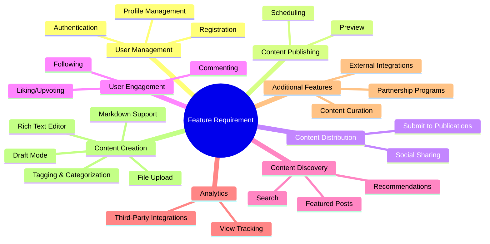

[[BlogDuaaeeg Overview]]

References
- [[PROJECTS/BlogDuaaeeg/Note Detail|Note Detail]]

**Contents**
#BlogDuaaeeg-feat-reqs
#BlogDuaaeeg-user-reqs 
#BlogDuaaeeg-key-feats 

## Feature Requirement 
#BlogDuaaeeg-feat-reqs
- The requirement based on **Medium** Blog website which can be described as following
	1. Content Creation**
		- Rich text editor (e.g., Quill, TinyMCE) for creating and editing blog posts with formatting options (bold, italic, headings, lists, code blocks, etc.)
		- Support for uploading Markdown (.md) files
		- Support markdown editor (write md file in website)
		- Ability to add tags and categories to posts
		- Draft mode for saving unfinished posts
		- File upload functionality for adding images and other media to posts
	
	2. Content Publishing**
		- Ability to publish posts with a unique URL
		- Option to schedule posts for future publishing
		- Post preview functionality before publishing
	
	3. **Content Distribution**
		- RSS feed generation for syndicating content to other platforms
		- Social sharing buttons (Twitter, Facebook, LinkedIn, etc.) for each post
		- Ability to submit posts to publications or channels within the platform
	
	4. **User Engagement**
		- Commenting system for users to engage with posts
		- Liking/upvoting system for posts
	
	5. * Content Discovery**
		- Search functionality for finding posts by title, author, tags, or categories
		- Featured posts or curated content sections on the homepage
		- Recommended posts based on user interests and past engagements 
		- Recommended posts based of Liking/upvoting system daily 
	
	6. **Analytics**
		- Basic analytics for authors to track views, likes, comments, and shares on their posts
		- Integration with third-party analytics tools (e.g., Google Analytics)
	
	7. **Additional Features**
		- Content curation system with human curators for highlighting high-quality content
	
	8. **Design and User Experience**
		- Clean, minimalistic design with a focus on readability and content presentation
		- Responsive design for optimal viewing experience on various devices
		- User-friendly navigation and content organization


## User Requirement
#BlogDuaaeeg-user-reqs 
- Detail
	- **User Management:**
	    - Registration and Authentication
	    - Profile Management
	- **Content Creation:**
	    - Rich Text Editing and Markdown Support
	    - Media Integration (Images, etc.)
	    - Categorization and Tagging
	    - Draft Saving and Post Scheduling
	- **Content Management:**
	    - Content Publishing with Unique URLs
	    - Post Previewing
	    - Updating and Unpublishing Existing Posts
	- **Content Distribution:**
	    - Submission to Publications within the Platform
	    - RSS Feed Support
	    - Social Sharing Integration
	- **User Engagement:**
	    - Liking/Upvoting Posts
	    - Commenting on Posts
	    - Following Authors
	- **Content Discovery:**
	    - Search Functionality (by title, author, tags, categories)
	    - Curated Sections (featured posts, recommendations)

```merm
mindmap
  root((User Requirements))
    User Registration
      Email/Username
      Password
      Profile Information
    User Authentication
      Login
      Logout
      Password Recovery
    Profile Management
      Edit Personal Information
        Name
        Bio
        Location
        Website
      Update Profile Picture
      Manage Publications
        Create
        Edit
        Delete
    Content Creation
      Write Blog Post
        Rich Text Editor
        Markdown Support
        Add Images/Media
        Formatting Options
          Headings
          Bold/Italic
          Lists
          Code Blocks
        Add Tags
        Add Categories
      Import Blog Post
        Upload Markdown File
      Save as Draft
      Schedule for Publishing
    Content Publishing
      Publish Blog Post
        Generate Unique URL
        Preview before Publishing
      Update Published Post
      Unpublish Post
    Content Distribution
      Submit to Publications
      RSS Feed
      Social Sharing
        Twitter
        Facebook
        LinkedIn
    User Engagement
      Like/Upvote Posts
      Comment on Posts
      Follow Authors
    Content Discovery
      Search Posts
        Title
        Author
        Tags
        Categories
      Explore Featured Posts
      View Recommended Posts
```


## Key Features Application
#BlogDuaaeeg-key-feats  
- Based on the user requirements and feature requirements. we can describe the **Key features** for application by following 
	1. **User Authentication and Registration**
	    - User registration with email/username and password
	    - Secure user authentication (login and logout)
	    - Password recovery mechanism
	2. **User Profiles**
	    - Ability to edit personal information (name, bio, location, website)
	    - Update profile picture
	    - Manage user's own publications (create, edit, delete)
	3. **Content Creation**     
	    - Rich text editor with formatting options (headings, bold/italic, lists, code blocks)
	    - Markdown support for writing and importing blog posts
	    - Image and media upload functionality
	    - Tagging and categorization of posts
	    - Draft mode for saving unfinished posts
	    - Scheduling posts for future publishing
	    - Can post blog as private and public.
	1. **Content Publishing**
	    - Publish posts with unique URLs
	    - Preview functionality before publishing
	    - Update and unpublish published posts
	2. **Content Distribution**
	    - Submit posts to publications within the platform
	    - Social sharing buttons (Twitter, Facebook, LinkedIn)
	3. **User Engagement**
	    - Liking/upvoting posts
	    - Commenting system for posts
	    - Follow/subscribe to authors
	4. **Content Discovery**
	    - Search functionality for posts (title, author, tags, categories)
	    - Featured posts or curated content sections
	    - Recommended posts based on user interests and engagement
	5. **Analytics**
	    - Basic analytics for authors (views, likes, comments, shares)
	    - Integration with third-party analytics tools (e.g., Google Analytics)

```merm
mindmap
  root((Keys))
    User Management
    User Authentication
    Content Management
    Content Distribution
    User Engagement
    Content Discovery
    Analytics
    Additional Features
```

