#Tools-Requirement
- Lang
	- **TypeScript** for developing with type-safe benefit
- Framework
	- **Next.js** for creating full-stack application 
- Styling
	- **TailwindCSS** for CSS utility
	- **Radix-UI** from UI Framework
- Database
	- **PostgreSQL** for database 
	- **Prisma** for database tool-designing & type-safe
- Utilities
	- **Zustand** for state-management
	- **Zod** for type-safe schema and validation
	- **JWT** for authentication
- Nice to have 
	- Implemented** Socket.io** for realtime communication and actors matching 
	- Implemented **Jest** for Testing Framework

#Models
- User
	- **Auth** : for authentication user schema
	- **User**  
- User Data & Preference
	- **Preference** : contain data that kept user preference
	- **DataAnalytics** :  for analyse data for using in algorithm 
		- **Contact**
		- **Review** **(Rating)**
		- **Location**
			- **Geometry**
- Message
	- **ChatRoom** : Room for each conversation
		- **Message**
- Transaction
	- **Payment** : Payment list when transaction had proceed 
	  
#Class-Diagrams
Based on #Models that  had been described above. can be writing in Class Diagrams like this.

| Diagram                              |
| ------------------------------------ |
| ![[Pasted image 20240223153639.png]] |


`Code`

```mermaid
classDiagram
	%%{init: {     'theme': 'forest', 'themeVariables': { 'fontSize': '4px', 'fontFamily':     'Inter', 'width': '100%', 'height': 'auto',  'primaryColor': '#BB2528',
      'primaryTextColor': '#000',
      'primaryBorderColor': '#7C0000',
      'secondaryColor': '#006100',
      'tertiaryColor': '#fff'}}}%%

    class Auth {
        +Int id
        +String~Uuid~ uid
        +String email
        +String password
        -DateTime createdAt
        -DateTime updatedAt
        +String userUuid
        +signIn(String email, String password) User
        +signUp(String email, String password) User
    }

    class User {
        +Int id
        +String~Uuid~ uid
        +String email
        -DateTime createdAt
        -DateTime updatedAt
        +String authUuidÏ
        +String userPreferenceUuid
        +getUser() User
		+createUser(String email, String password)  User
        +createPreference()  Preference
        +createReview(Object createReviewParams) Review
        +createPet(Object createPetParams) Pet
        +sendMessage(String content, String~Uuid~ userUuId, String~Uuid~ roomChatId) Message
    }

    note for User "createReviewParams\n String reviewDetail,\n Float rating,\n  String~Uuid~ ownerUuid,\n String~Uuid~ toUserUuid\n\n createPetParams\n String name,\n String type,\n String species,\n Int age"
        
    class Preference {
        +Int idÏ
        +String~Uuid~ uid
        +String~Uuid~ contractUuid
        +String~Uuid~ dataAnlyticsUuid
        -DateTime createdAt
        -DateTime updatedAt
        +String userUuid
        +setContact(String email, String phone) Contact
        +setDataAnalytics(String budget, Float rating,Bool willingnessToTravel) void
    }

    class Transaction {
        +Int id
        +String~Uuid~ uid
        -DateTime createdAt
        -DateTime updatedAt
        +String userUuid
        +processTransaction() void
        +createTransaction(Float amount , String description ) Transaction
        +getTransaction() Transaction
    }

    class Review {
        +Int id
        +String~Uuid~ uid
        +String~Uuid~ OwnerUuid
        +String~Uuid~ toUserUuid
        +String reviewDetail
        +Float rating
        -DateTime createdAt
        -DateTime updatedAt
        +String userUuid
        +updateReview(String reviewDetail, Float rating, String~Uuid~ reviewUuid) void
        +getReviews(String~Uuid~ toUserUuid) Review
    }

    class Message {
        +Int id
        +String~Uuid~ uid
        +String content
        -DateTime createdAt
        -DateTime updatedAt
        +Int userId
        +Int roomChatId
    }

    class RoomChat {
        +Int id
        +String~Uuid~ uid
        -DateTime createdAt
        -DateTime updatedAt
        +addUser(String~Uuid~ userUuId) void
        +removeUser(String~Uuid~ userUuId) void
    }


    class Contact {
        +Int id
        +String uid
        +String email
        +String phone
        -DateTime createdAt
        -DateTime updatedAt
        +updateContact(String email, String phone) void
    }

    class DataAnalytics {
        +Int id
        +String uuid
        +String budget
        +Float rating
        +Int age
        +Boolean willingnessToTravel
        +Boolean isOpenForAdopter
        +Boolean isOpenForPetDelivery
        -DateTime createdAt
        -DateTime updatedAt
        +String locationUuid
        +analyzeData() void
    }

    
    
    class Proposal {
        +Int id
        +String~Uuid~ uid
        +String petUuidString~Uuid~
        +String~Uuid~ proposalOwnerUuid
        +String~Uuid~ toUserUuid?
        +String~Uuid~ refrerenceListUuid
        +String~Uuid~ roomChatUuid
        +Float offeringPrice
        +String status
        -DateTime createdAt
        -DateTime updatedAt
        +acceptProposal() void
        +rejectProposal() void
        +createProposal(Object createProposalParams)  Proposal
    }

    note for Proposal  "createProposalParams\nString~Uuid~ proposalOwnerUuid,\n Int offeringPrice,\n String~Uuid~ petUuid,\n String~Uuid~ toUserUuid"


    class Location {
        +Int id
        +String~Uuid~ uid
        +String type
        +Json properties
        +String geometryUuid
        +updateLocation(String type, Object properties, String geometryUuid) void
    }

    class Geometry {
        +Int id
        +String~Uuid~ uid
        +Float[] coordinates
        +String type
        +updateGeometry(Float[] coordinates, String type ) void
    }


    class Pet {
        +Int id
        +String~Uuid~ uid
        +String~Uuid~ OwnerUserUuid
        +String name
        +String type
        +String species
        +Int age
        -DateTime createdAt
        -DateTime updatedAt
        +updatePet(String name, String type, String species, Int age) void
        +deletePet(String~Uuid~ petUuid)
    }


    class AdopterList {
        +Int id
        +String~Uuid~ uid
        +Pet[] adoptableList
        -DateTime createdAt
        -DateTime updatedAt
        +createPetDeliveryList() Pet

    }

    class PetDeliveryList {
        +Int id
        +String~Uuid~ uid
        +String~Uuid~ petUuid
        -DateTime createdAt
        -DateTime updatedAt
        +createAdopterList() Pet
    }

    class SharedData {
        +String~Uuid~ ownerUuid
        +String address
        +Int maxPrice
        +Int minPrice
        +Boolean willingnessToTravel
    }

    Auth "1" --> "1" User : has
    User "1" --> "1" Preference : has
    DataAnalytics "1" --* "1" Preference : has
    Contact "1" --* "1" Preference : has
    Location "1" --* "1" Preference : has
    Geometry "1" --* "1" Location : has
    User "1" --> "*" Transaction : has
    User "1" --> "*" Proposal : has

    Proposal "1" --> "1" Transaction : created
    Proposal "1" --> "1" RoomChat : has
    Proposal "1" --> "1" PetDeliveryList : has
    Proposal "1" --> "1" AdopterList : has

    User "1" --> "*" Review : has
    User "1" --> "*" Message : sends
    
    Pet "1" --> "*" Proposal : contains
    Pet "*" <-- "1" User : has

    SharedData "1" --> "1" PetDeliveryList : has
    SharedData "1" --> "1" AdopterList : has
    PetDeliveryList "*" <-- "1" User : create
    AdopterList "*" <-- "1" User : create
    PetDeliveryList "*" --> "1" Pet : has

    RoomChat "1" --> "*" Message : contains
    RoomChat "1" --o "*" User : contains
    RoomChat "1" --> "1" PetDeliveryList : has
    RoomChat "1" --> "1" AdopterList : has



    

    
```


```ts
classDef style1 fill:#AFC9F8;

classDef style2 fill:#f9d5e5;

classDef style3 fill:#f9cb9c;

classDef style4 fill:#d9ead3;

classDef style5 fill:#c9daf8;

classDef style6 fill:#d0e0e3;

classDef style7 fill:#e6bc4e;

classDef style8 fill:#6aa84f;

classDef style9 fill:#a4c2f4;

classDef style10 fill:#b4a7d6;

classDef style11 fill:#9fe2bf;

classDef style12 fill:#ffd966;

classDef style13 fill:#e06666;

classDef style14 fill:#6d9eeb;

classDef style15 fill:#8e7cc3;

classDef style16 fill:#0c343d;

classDef style17 fill:#134f5c;

classDef style18 fill:#0b5394;

classDef style19 fill:#351c75;

classDef style20 fill:#20124d;
```
