### #UML-Pattern-Design   

**Use-case Diagram**
	Core actors are Adopter the person who wants to adopt pets and Sender the person who wants to send their dog to Adopter
- Actors
	- Adopter: Looking to adopt from Sender
	- Sender: Sending their pets to Adopter
	- Use-case
	- Find and match adopters with dogs seeking homes :
	- Sub-Use Case: Define adoption terms and pricing.
	- Sub-Use Case: Initiate communication between Adopter and Sender.
	- Sub-Use Case: Facilitate the adoption transaction.
==Sequence Diagram== 
	1. Adopter sends a request to find a dog.
	2. System matches Adopter with available dogs and sends options.
	3. Adopter selects a dog and defines adoption terms.
	4. System notifies Sender about the interest.
	5. Sender responds, and communication is initiated.
	6. Adoption transaction details are confirmed.
	7. Adopter pays, and the system deducts the service fee.
	8. Transaction details are stored.

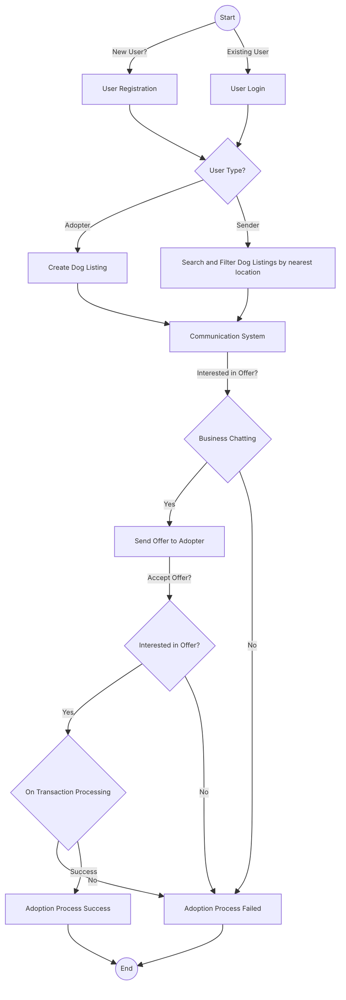
<mark style="background: #BBFABBA6;">Activity Diagram</mark>

1. **Adoption Process**
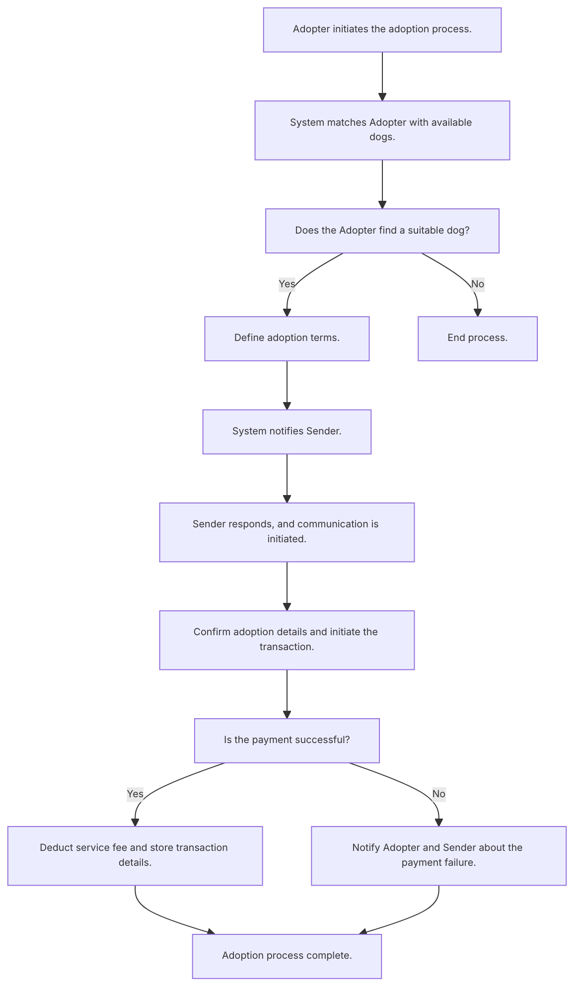

2. Matching Algorithm
	- #User-Preference
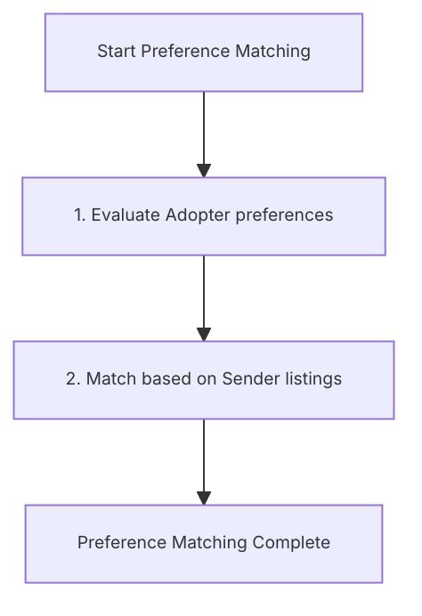

- #Geographical-Proximity:
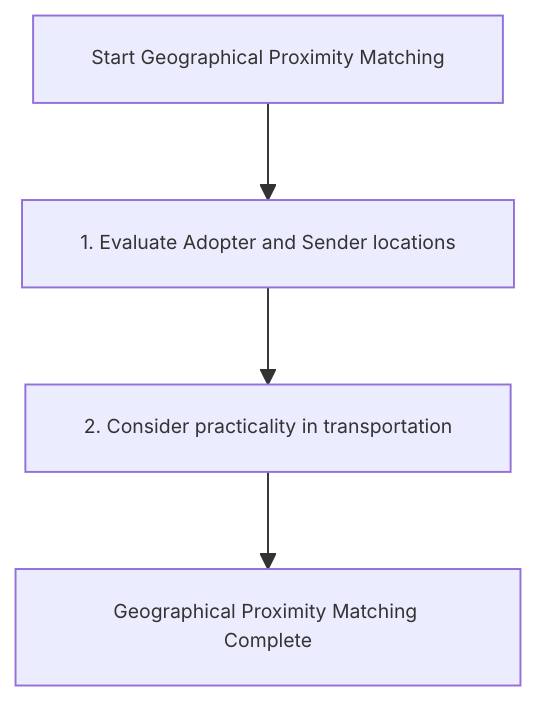

- #Budget-Matching

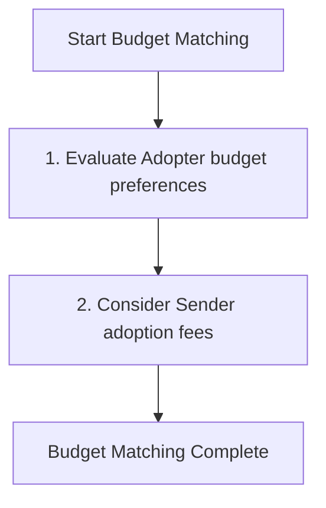

- #User-Feedback-and-Ratings
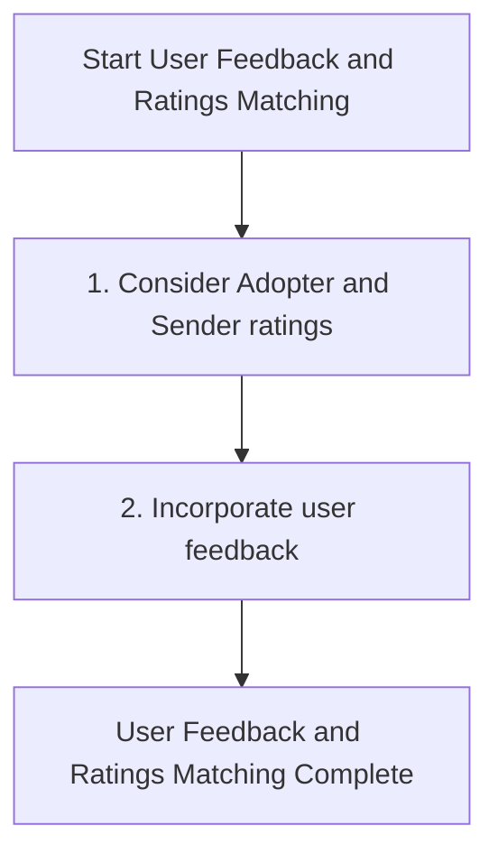

- #Machine-Learning
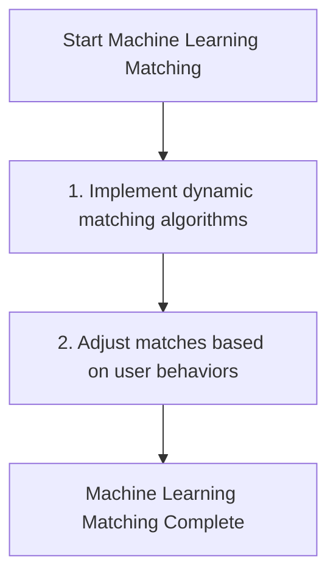

- Sequence diagram for Actors usage
	- #Adopter
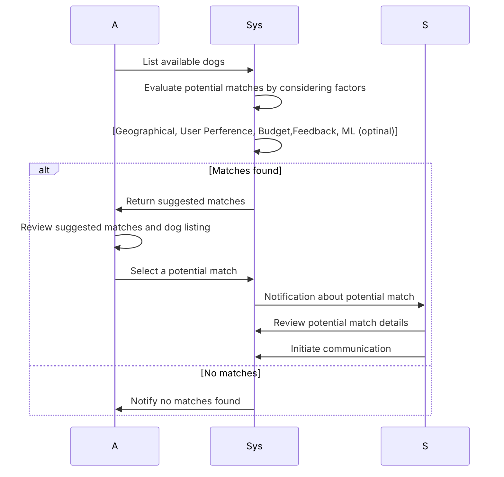

- #Sender
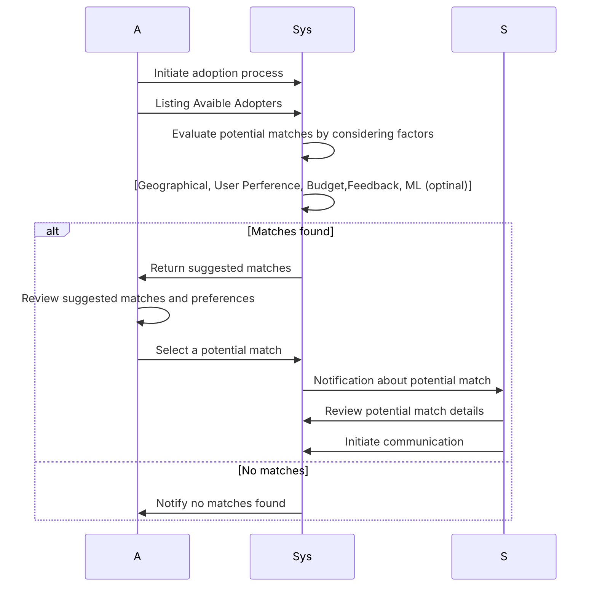

#Review-and-Rating-Process 
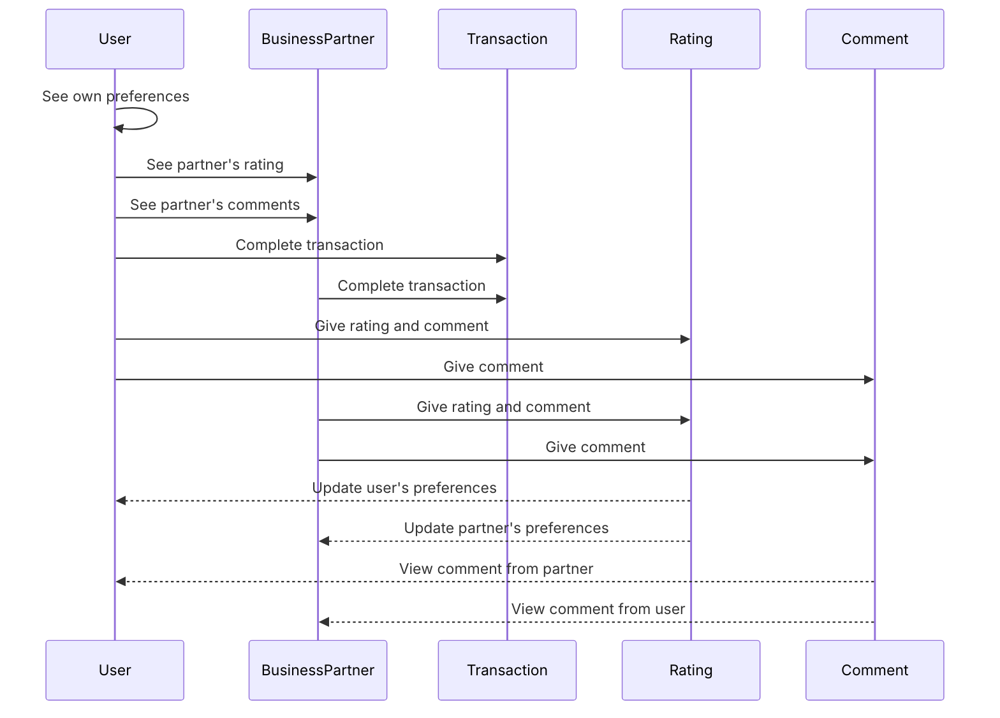

#Payment-and-Proposal-Process 
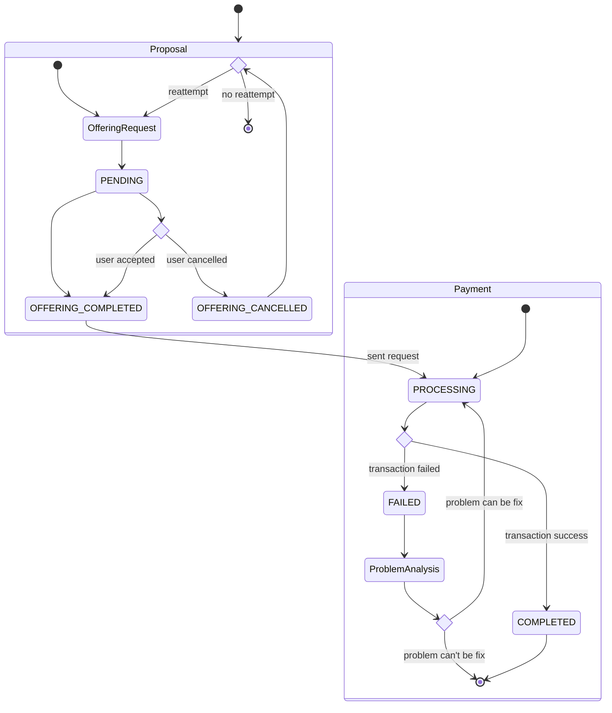
