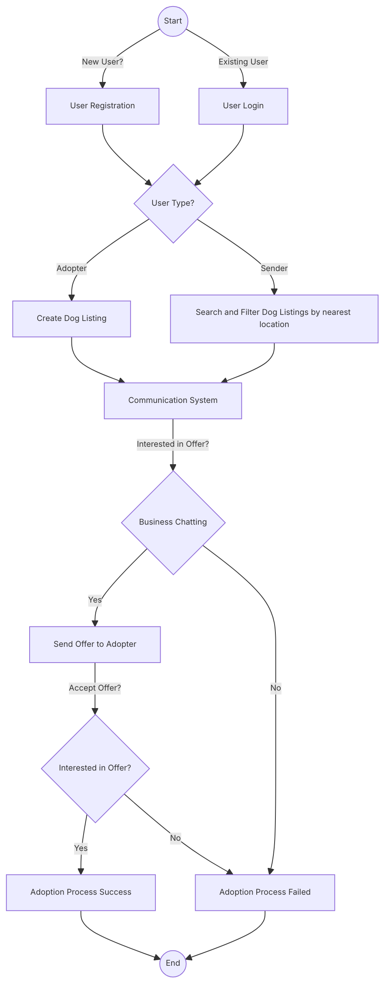

```MD
ให้แต่กลุ่ม นำเสนอไอเดีย สินค้าหรือบริการที่มีความเป็นนวัตกรรม(สิ่งใหม่หรือดีกว่าเดิม) พร้อมทั้งระบุว่า
-สินค้าหรือบริการนั้นคืออะไร 
-กลุ่มลูกค้าคือคนกลุ่มใด
-ทำอะไรได้บ้าง 
-แต่ละความสามารถใช้อัลกอริทึม หรือ ใช้บริการจาก Cloud Service ใด
นำเสนอด้วยสไลด์และแสดง Proof of Concept เพื่อให้เชื่อมั่นว่าไอเดียของสินค้าหรือบริการนี้สามารถเป็นจริงได้ 
.
กำหนดเวลาคือ
-22 มค. : วันนี้โพสชื่อสมาชิกในกลุ่ม พร้อมทั้งชื่อสินค้าหรือชื่อบริการ ที่เราคิดมาก่อน เพื่อลดความซ้ำซ้อนของแต่ละกลุ่มที่จะทำงานเหมือนกัน
-22,26,29Jan,2Feb :ให้เวลานศไปทำงานชิ้นที่3 งานคู่ (59/2 = ~29กลุ่ม) no class
-2 Feb ก่อน 16.00 น. : ส่งงานชิ้นที่ 3 (โดยโพสลิ้งค์ของสไลด์+ลิ้งค์ vdo นำเสนอไม่เกิน3-5นาที ต่อจากชื่อสมาชิกในกลุ่ม)
.
ปล1 : จำลองว่าแต่ละกลุ่มกำลังจะไปเสนอไอเดียธุรกิจเพื่อให้นักลงทุนเห็นผลงานและลงทุนไปกับบริษัทของเรา โดยเราจะต้องส่งสไลด์และคลิปvdoไปให้กับนักลงทุนเพื่อพิจารณาร่วมทุน (ลองดูรายการ Shark Tank Thailand  เป็นแนวทางได้ครับ)
```

ปัญหาที่นำมสู่การสร้าง Application
- สาเหตุ
	- คนเลี้ยงสุนัขในประเทศไทยส่วนมากมักเลี้ยงไม่ไหว โดยปัจจัยอื่น ๆ มาเกี่ยวข้องอาทิเช่น เงินเลี้ยงดูไม่พอ, สุนัขมีเยอะเกิน เลี้ยงไม่ไหว ๆ ลๆ 
	- ธุรกิจการแลกเปลี่ยนสุนัขที่เป็นพันธุ์หายากมหรือมีความสวยงามเป็นวงที่รู้จักน้อยในประเทศไทย ทำให้อัตราการแลกเปลี่ยนน้อย
	- มีความรู้หรือการตระหนักถึงความสำคัญของการปล่อยเป็นสุนัขจรจัดไม่เพียงพอ ของคนในสังคมไทย 

- ปัญหา
	- ทำให้คนหที่มีเลี้ยงสุนัขจำนวนมาก เลี้ยงไม่ไหว จึงมักแก้ปัญหาที่ไม่ถูกวิธีด้วยวิธีต่าง ๆ  เพื่อลดปัญหาการเลี้ยงไม่ไหวของตนเอง จึงนำไปสู่การเกิดปัญหาอีกหลาย ๆ  อย่างที่ไม่ควรจะเกิดขึ้นโดยผลกระทบที่เกิดขึ้นมากที่สุดคือ** ปล่อยสุนัขให้กลายเป็น สุนัทจรจัด**
	- การที่ปล่อยสุนัทจำนวนมากเป็น สุนัขจรจัด เป็นอีกสาเหตุปัญหาที่ทำให้เกิดปัญหาอื่น ๆ ตาม อาทิเช่น
		- ประชากรสัตว์เลี้ยงมากเกินไปทำให้เกิดปัญหาสัตว์จรจัดและถูกทิ้งเป็นจำนวนมาก
		- อันตรายจากการจราจรและอุบัติเหตุของสัตว์ที่เดินเร่รอน

##### #สินค้าหรือบริการนั้นคืออะไร (**Core feature**)
- เป็นการบริการกันระหว่าง **คนรับเลี้ยงสุนัข** ที่ต้องการสนุัขมารับเลี้ยง และ **คนหาบ้านใหสนุัข** ที่มองหาบ้านให้สุนัขได้อยู่ 

##### #กลุ่มลูกค้าคือคนกลุ่มใด
Actors
- **คนรับเลี้ยงสัตว์** -> คนที่เปิดเปิดรับสัตว์เลี้ยง
	- คนที่ต้องการรับเลี้ยง   
	- คนที่ต้องการนำไปทำธุรกิจต่อ
- **คนหาบ้านให้สุนัข** -> ส่งต่อสุนัขให้กับคนที่รับเลี้ยงสัตว์
  
  ##### #ทำอะไรได้บ้าง
  **ระบบธุรกิจ**
  - บริการ
	  - **ความปลอดภัย**
		  - ติดตามความเป็นอยู่ของสุนัขหลังจากบริการให้คนรับเลี้ยง
	
  - การทำธุรกรรม
	  - **คนหาบ้านให้สุนัข** สามารถตั้งราคาแลกเปลี่ยนให้กับ **คนรับเลี้ยงสัตว์** ได้ตั้งแต่ 0 - ราคาสูงสุดที่อยากตั้ง 
	  - **คนรับเลี้ยงสัตว์** จะทำการซื้อตามราคาที่ **คนหาบ้านให้สุนัข** ได้ตั้งไว้ โดยแต่ละการทำธุรกรรมแต่ละรอบจะหักค่าบริการของแอป 15% 
	    **Example**: **คนหาบ้านให้สุนัข** ตั้งราคาการแลกเปลี่ยนที่ 10,000 บาท เมื่อ **คนรับเลี้ยงสัตว์** **รับมาการทำธุรกรรม**จะถูกจำแนกได้เป็นตั้งนี้
		- **คนรับเลี้ยงสัตว์** ต้องจ่ายเงินในราคาเต็ม 10,000
		- **ค่าบริการ (15%)** เงินส่วนที่ได้จากการทำธุรกรรมแต่ละรอบ (10,000 * 15%) = 1,500 บาท
	    - **คนหาบ้านให้เลี้ยงสัตว์** จะถูกหักค่าบริการ 15% -> 10,000 + (10,000 * 15%) = 11,500 บาท

	เหตุผลของลักษณะการคิดบริการ
		เนื่องจากธุรกิจแบบนี้ **คนรับเลี้ยงสัตว์** -> ซึ่งเป็น **Demand** มีน้อยกว่า **คนหาบ้านให้สุนัข** ซึ่งเป็น **Supply** จึงต้องหักในค่าบริการในฝั่งของ **Supply** เพื่อให้เกิดความสมดุลกันของระบบการซื้อขาย
		
	
   ##### #แต่ละความสามารถใช้อัลกอริทึมหรือใช้บริการจากCloud-Serviceใด
   - Core Algorithms and Features:
	   - **Matching Algorithm**: ใช้อัลกอริธึมการจับคู่ที่ซับซ้อนเพื่อจับคู่ **คนหาบ้านให้สุนัข** กับ **คนรับเลี้ยงสัตว์** โดยพิจารณาจากปัจจัยต่างๆ เช่น สถานที่ ความพร้อมให้บริการ ความชอบ และรีวิวที่ผ่านมา
	   - **Communication System**: ฟีเจอร์ที่ช่วยให้ผู้ใช้ทั้งสองประเภท (ผู้ที่ต้องการรับเลี้ยงสุนัขและผู้ที่กำลังมองหาบ้านสำหรับสุนัขของตน) สามารถโต้ตอบกันได้
	   - **Pet Tracking**: สร้างอัลกอริธึมเพื่อติดตามและอัพเดตตำแหน่งและความเป็นอยู่ที่ดีของสัตว์เลี้ยงในช่วงระยะเวลาการให้บริการ สิ่งนี้ทำให้เจ้าของสัตว์เลี้ยงมีความโปร่งใสและสบายใจ
	     
   - บริการ Cloud Service 
	   - **Database Storage (Amazon Cloud Storage)**: ใช้บริการฐานข้อมูลบนคลาวด์ของ Amazon เพื่อจัดเก็บข้อมูลผู้ใช้ ข้อมูลสัตว์เลี้ยง ประวัติการทำธุรกรรม และบทวิจารณ์
	   - **Authentication (Firebase Auth):** ใช้การรับรองความถูกต้องของผู้ใช้อย่างปลอดภัยโดยใช้บริการต่าง ๆ  เพื่อรับรองความเป็นส่วนตัวและความปลอดภัยของบัญชีผู้ใช้
	   - **Geolocation Services (AWS Location Service):** ผสานรวมบริการระบุตำแหน่งทางภูมิศาสตร์ เพื่อระบุความใกล้ชิดของเจ้าของสัตว์เลี้ยงและพี่เลี้ยงสัตว์เลี้ยงเพื่อการจับคู่ที่ดียิ่งขึ้น
	   - **Payment Gateway (Stripe):** ใช้บริการเกตเวย์การชำระเงินของ Stripe เพื่อจัดการธุรกรรมทางการเงินอย่างปลอดภัย และเป็นมิตรต่อการพัฒนาระบบ
	   - **Notification Service** **(Amazon Simple Notification Service (SNS)):** ใช้บริการแจ้งเตือนแบบพุชของ Amazon Simple Notification Service (SNS) เพื่อส่งการอัปเดตแบบเรียลไทม์ไปยังผู้ใช้
	   - **Monitoring and Analytics (AWS CloudWatch):** ใช้บริการตรวจสอบและวิเคราะห์บนคลาวด์ AWS CloudWatch  เพื่อติดตามประสิทธิภาพของแอปพลิเคชัน พฤติกรรมผู้ใช้ และระบุจุดที่ต้องปรับปรุง
	   - **Security Services (AWS Identity and Access Management (IAM)):** ใช้บริการรักษาความปลอดภัยบนคลาวด์  AWS Identity and Access Management (IAM)  เพื่อควบคุมการเข้าถึงทรัพยากรและรับรองความปลอดภัยของข้อมูล

### **Proof of Concept**
#####  #ขอบเขตและเครื่องมือในการจำลองการพัฒนาApplication
- Mobile App 
	- Application Builder 
		Thunkable: มั่นใจในการพัฒนาที่รวดเร็วและการอัปเดตที่ง่ายดาย **ด้วยรูปแบบการพัฒนาระบบแบบ Low-code**  อีกทั้งยังสามารถพอร์ต Application ข้ามแพลตฟอร์ม 
- Services
	   - **Authentication (Firebase Auth):** 
	   - **Geolocation Services (Thunkable Location Build-in)**
- Features
	   - **Communication System** **(Firestore Implemented)**
	   - **Dog Adopter Creator** (Firestore Implemented)
	   - **Dog Adopter Listing** **(Firestore Implemented)**
	   - **Adoption Process Management** **(Firestore Implemented)**

- **Flowchart**

