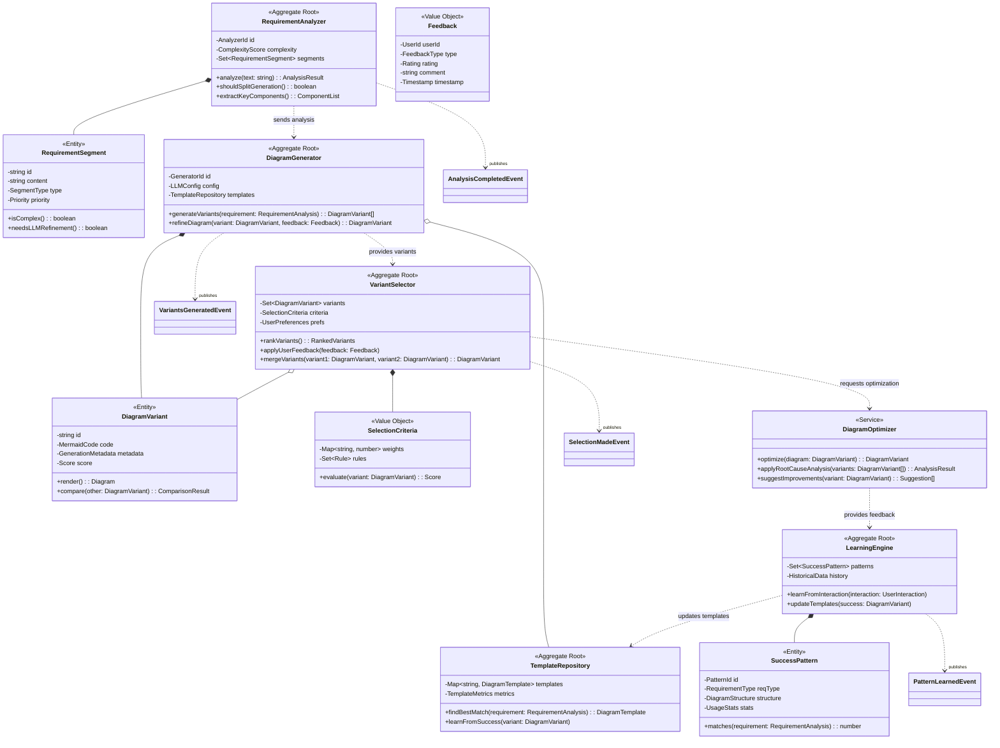

```mermaid
classDiagram
    %% Input Processing Domain
    class RequirementAnalyzer {
        <<Aggregate Root>>
        -AnalyzerId id
        -ComplexityScore complexity
        -Set~RequirementSegment~ segments
        +analyze(text: string): AnalysisResult
        +shouldSplitGeneration(): boolean
        +extractKeyComponents(): ComponentList
    }

    class RequirementSegment {
        <<Entity>>
        -string id
        -string content
        -SegmentType type
        -Priority priority
        +isComplex(): boolean
        +needsLLMRefinement(): boolean
    }

    %% LLM Processing Domain
    class DiagramGenerator {
        <<Aggregate Root>>
        -GeneratorId id
        -LLMConfig config
        -TemplateRepository templates
        +generateVariants(requirement: RequirementAnalysis): DiagramVariant[]
        +refineDiagram(variant: DiagramVariant, feedback: Feedback): DiagramVariant
    }

    class DiagramVariant {
        <<Entity>>
        -string id
        -MermaidCode code
        -GenerationMetadata metadata
        -Score score
        +render(): Diagram
        +compare(other: DiagramVariant): ComparisonResult
    }

    class TemplateRepository {
        <<Aggregate Root>>
        -Map~string, DiagramTemplate~ templates
        -TemplateMetrics metrics
        +findBestMatch(requirement: RequirementAnalysis): DiagramTemplate
        +learnFromSuccess(variant: DiagramVariant)
    }

    %% Selection Domain
    class VariantSelector {
        <<Aggregate Root>>
        -Set~DiagramVariant~ variants
        -SelectionCriteria criteria
        -UserPreferences prefs
        +rankVariants(): RankedVariants
        +applyUserFeedback(feedback: Feedback)
        +mergeVariants(variant1: DiagramVariant, variant2: DiagramVariant): DiagramVariant
    }

    class SelectionCriteria {
        <<Value Object>>
        -Map~string, number~ weights
        -Set~Rule~ rules
        +evaluate(variant: DiagramVariant): Score
    }

    %% Refinement Domain
    class DiagramOptimizer {
        <<Service>>
        +optimize(diagram: DiagramVariant): DiagramVariant
        +applyRootCauseAnalysis(variants: DiagramVariant[]): AnalysisResult
        +suggestImprovements(variant: DiagramVariant): Suggestion[]
    }

    class Feedback {
        <<Value Object>>
        -UserId userId
        -FeedbackType type
        -Rating rating
        -string comment
        -Timestamp timestamp
    }

    %% Learning Domain
    class LearningEngine {
        <<Aggregate Root>>
        -Set~SuccessPattern~ patterns
        -HistoricalData history
        +learnFromInteraction(interaction: UserInteraction)
        +updateTemplates(success: DiagramVariant)
    }

    class SuccessPattern {
        <<Entity>>
        -PatternId id
        -RequirementType reqType
        -DiagramStructure structure
        -UsageStats stats
        +matches(requirement: RequirementAnalysis): number
    }

    %% Relationships
    RequirementAnalyzer *-- RequirementSegment
    DiagramGenerator *-- DiagramVariant
    DiagramGenerator o-- TemplateRepository
    VariantSelector *-- SelectionCriteria
    VariantSelector o-- DiagramVariant
    LearningEngine *-- SuccessPattern
    
    RequirementAnalyzer ..> DiagramGenerator: sends analysis
    DiagramGenerator ..> VariantSelector: provides variants
    VariantSelector ..> DiagramOptimizer: requests optimization
    DiagramOptimizer ..> LearningEngine: provides feedback
    LearningEngine ..> TemplateRepository: updates templates

    %% Event flows
    RequirementAnalyzer ..> "publishes" AnalysisCompletedEvent
    DiagramGenerator ..> "publishes" VariantsGeneratedEvent
    VariantSelector ..> "publishes" SelectionMadeEvent
    LearningEngine ..> "publishes" PatternLearnedEvent
```

