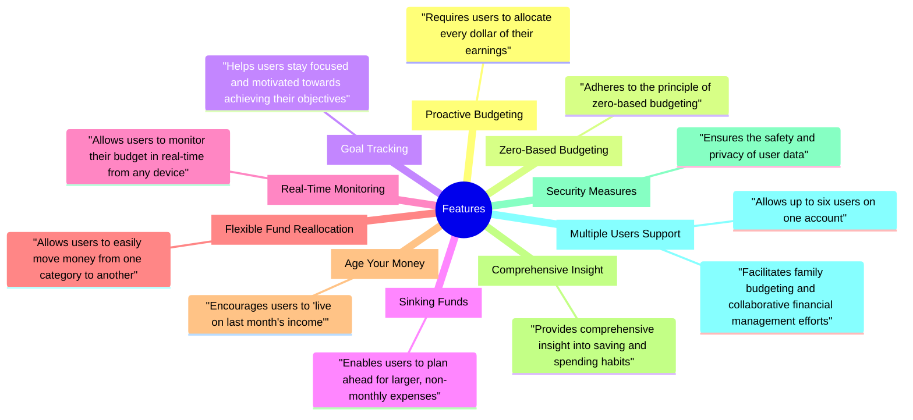
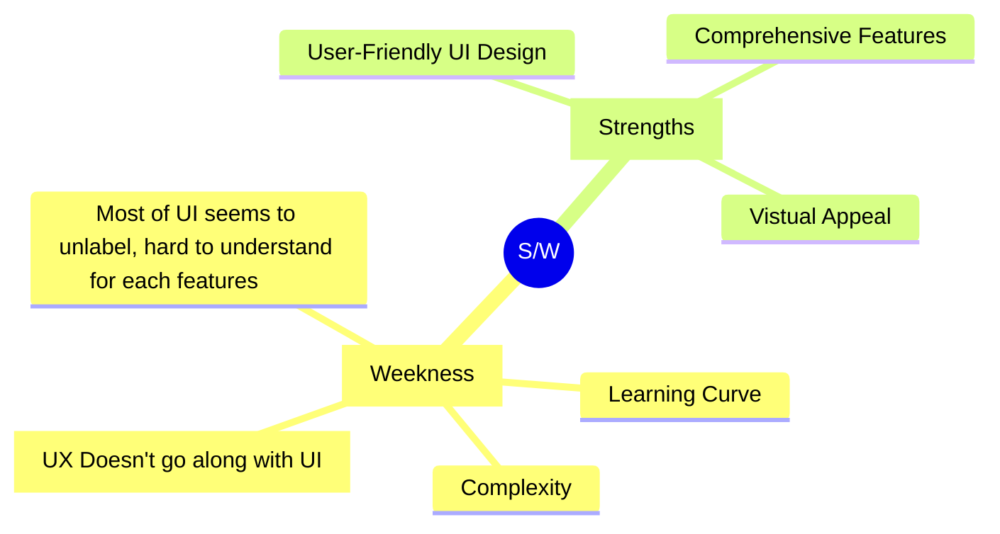
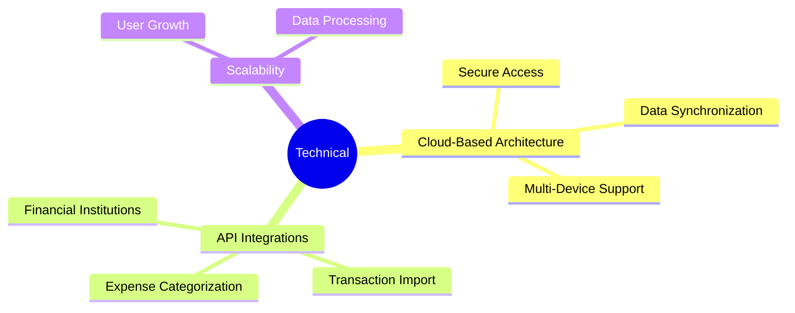

### #Case-Study
#### 1. YNAB (You Need a Budget)

	YNAB (You Need a Budget) is a comprehensive personal finance management tool that offers unique features to help users proactively manage their finances.

- Key features

- System Analysis
![[YNAB - SA.pdf]]

- Strengths/Weakness 

- Technical Integration 

