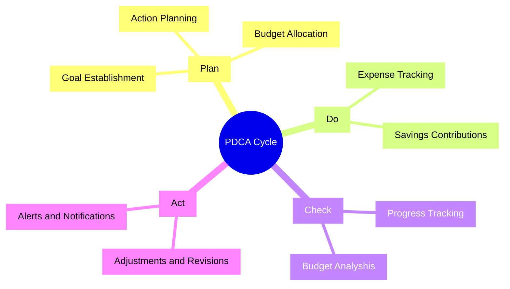

#### #PDCA-Integration

1. **Plan:**
    - **Budget Planning Tools**: Allow users to set financial goals, create budgets, allocate funds to different categories, and plan for future expenses.
    - **Goal Setting**: Enable users to establish saving goals, debt reduction targets, or investment objectives within the app.
    
2. **Do:**
    - **Expense Tracking**: Provide tools for users to record their expenses, categorize transactions, and track spending in real-time.
    - **Income Management**: Allow users to input and track their income sources, including salaries, bonuses, or additional earnings.
    
3. **Check:**
    - **Financial Reports**: Generate detailed reports on income, expenses, savings progress, and budget adherence for users to review their financial status.
    - **Analytics and Insights**: Offer data visualization features like charts or graphs to help users analyze their financial habits and identify areas for improvement.
    
4. **Act:**
    - **Budget Adjustments**: Enable users to make adjustments to their budgets based on spending patterns, income changes, or financial goals.
    - **Alerts and Reminders**: Provide notifications for overspending, upcoming bills, or irregular expenses to prompt users to take necessary actions.