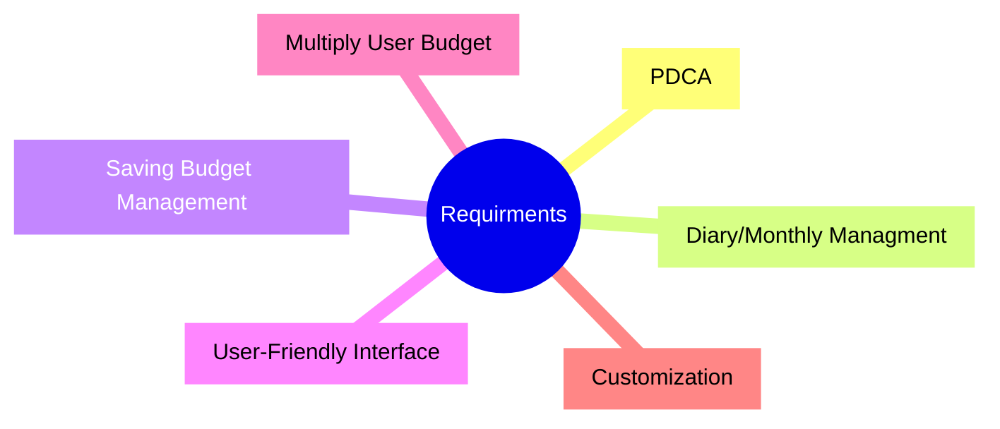

	Application that provide money management features. Designed to help users take control of their finances effectively.
		
- Following concept that had studied on [[Case-Study (YNAB)]] We had review the concept and conclude the context following by these 

#### #PaoSatang-System-Analysis

1. #User-Requirment-PaoSatang 
	1. User can handle the PDCA cycle (Plan-Do-Check-Action) [[Expense Income Guide]] #Follow-the-PDCA-Guide-Plan-Do-Check-Action 
	2. User can handle diary/monthly income/expenses [[Resource and Debt]] #Make-the-Resource-before-made-Debt
	3. User can manage their  Saving budget  [[Based of Wealthy]] #Earning 
	4. it should provide friendly-usage
	5. User can customization categories, budgets, and reports to suit individual needs.

1.  #Key-Features-PaoSatang
	1. **PDCA Cycle Integration **:
	    - Incorporate the PDCA (Plan-Do-Check-Action) cycle to help users plan their finances, execute financial activities, review their progress, and take necessary actions to improve their financial health. [[PROJECTS/PaoSatang/Note Detail]]  #PDCA-Integration
	    
	2. **Diary for Income/Expenses**:
	    - Include a diary feature where users can log their daily income and expenses, categorize transactions, and track their financial activities over time to gain insights into their spending habits.
	    
	3. **Saving Budget Management**:
	    - Provide a dedicated section for managing saving budgets, allowing users to set savings goals, track their progress, and allocate funds towards different saving categories such as emergency funds, vacations, or investments.
	    
	4. **User-Friendly Interface**:
	    - Design an intuitive and user-friendly interface with clear navigation, visual representations of financial data, interactive charts for expense analysis, and customizable settings to tailor the app to individual preferences.

	5. **Multiply User Budget**:
		   - Manage their finances across various user's budget efficiently. Users can allocate funds, track expenses in single Account.

	6.  **Automating Repetitive**: Helps user for reducing repeating action/tasks
		   - Auto-Assign #Case-Study 
			   - designed to automatically allocate or assign incoming funds to specific budget categories based on predefined rules or criteria set by the user
			   - saves users time and effort by automating the allocation of income to designated budget categories.
		- Scheduled Transactions: 
			- allows users to set up recurring transactions or expenses to be automatically recorded at specified intervals, minimizing repetitive data entry tasks.
		- Rule-Based Categorization (Optional): 
			- users can create rules to automatically assign transactions to specific categories based on predefined criteria,

	7. **Reporting Tools**: reporting tools that generate detailed insights for analysed and providing actionable information at a glance.
			1. **Expense Reports**: Generate reports that detail expenses categorized by type, date, and amount, providing users with a clear overview of their spending patterns.
			2. **Income Analysis**: Offer reports that analyze income sources, frequency, and trends to help users understand their cash flow and sources of revenue.
			3. **Budget Adherence**: Provide reports that compare actual spending against budgeted amounts, highlighting areas of overspending or underspending to aid users in adjusting their financial plans.
			4. **Category Breakdown**: Display reports that break down expenses by categories such as groceries, utilities, entertainment, etc., allowing users to identify where their money is being allocated.

2. #Technical-Integration-PaoSatang
	1. User Authentication
	2. Cloud Data Storage
	3. Cloud Service
	4. Charting and Data Visualization
	5. Notifications and Reminders
	6. Key Features Integration
	7. Rule-Based Automation

