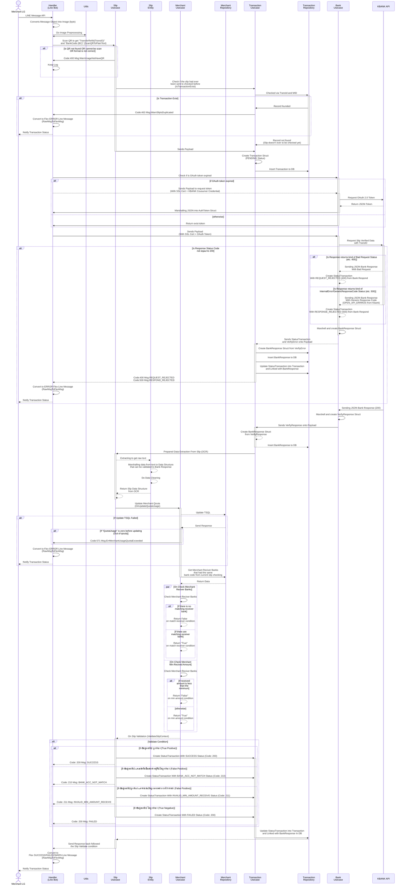

## Core Features
- Check Slip Process

```mermaid
sequenceDiagram

actor LG AS Merchant LG

participant Handler AS Handler <br/> (Line Bot)

participant Utils

participant SlipUse AS Slip <br/> Usecase

participant SlipEntity AS Slip <br/> Entity

participant MUSE as Merchant <br/> Usecase

participant MRepo as Merchant <br/> Repository

participant TransUse AS Transaction <br/> Usecase

participant TransRepo AS Transaction <br/> Repository

participant BankUse AS Bank <br/> Usecase

participant KB AS KBANK API

  
  

LG->>Handler: LINE Message API

Handler->>Handler: Converts Message Object Into Image (byte)

Handler->>Utils: Do Image Preprocessing

Utils->>Handler:

Handler->>+SlipUse: Scan QR to get "TransferRefId(TransID)" <br /> and "BankCode (BC)" (ScanQRToPlainText)

  

alt Is QR not found OR cannot be scan <br /> OR format is not correct

SlipUse->>Handler: Code:400 Msg:WarnImageNotHaveQR

Handler->>Handler: Keep Log

end

SlipUse->>TransUse: Check if the slip had ever <br/> been sent to checked before <br/> (IsTransactionExist)

TransUse->>+TransRepo: Checked via TransId and MID

alt Is Transaction Exist

TransRepo->>TransUse: Record founded

TransUse->>Handler: Code:463 Msg:WarnSlipIsDuplicated

Handler->>Handler: Convert to Flex ERROR Line Message <br/> (RawMsgToFlexMsg)

Handler-->>LG: Notify Transaction Status

end

TransRepo->>-TransUse: Record not found <br /> (Slip doesn't ever to be checked yet)

SlipUse->>-TransUse: Sends Payload

TransUse->>TransUse: Create Transaction Struct <br /> (PENDING Status)

TransUse->>TransRepo: Insert Transaction to DB

Handler->>+BankUse: Check if is OAuth token expired

alt if OAuth token expired

Handler-->>+BankUse: Sends Payload to request token <br/> (With SSL Cert + KBANK Cousumer Credential)

BankUse->>KB: Request OAuth 2.0 Token

KB-->>BankUse: Return JSON Token

BankUse->>-Handler: Marshalling JSON into AuthToken Struct

else otherwise

BankUse->>-Handler: Return exist token

end

Handler->>+BankUse: Sends Payload <br/> (With SSL Cert + OAuth Token)

BankUse->>+KB: Request Slip Verified Data <br /> with TransID

alt Is Response Status Code <br/> not eqaul to 200

alt Is Response returns kind of Bad Request Status (etc. 400)

KB-->>BankUse: Sending JSON Bank Response <br /> With Bad Request

BankUse-->>BankUse: Create StatusTransaction <br/> With REQUEST_REJECTED (400) from Bank Respond

else Is Response returns kind of <br/> InternalError/GenericResponseCode Status (etc. 500)

KB-->>-BankUse: Sending JSON Bank Response <br /> With Generic Response Code <br/> (OPEN_API_ERRROS from Kbank)

BankUse-->>BankUse: Create StatusTransaction <br/> With RESPONSE_REJECTED (500) from Bank Respond

end

BankUse->>-BankUse: Marshell and create BankResponse Struct

BankUse-->>+TransUse: Sends StatusTransaction <br /> and VerfiyError onto Payload

TransUse->>TransRepo:Create BankResponse Struct from VerfiyError<br/>

TransUse->>TransRepo:Insert BankResponse to DB<br/>

TransUse->>TransRepo:Update StatusTransaction into Transaction <br> and Linked with BankResponse <br/>

TransUse-->>-Handler: Code:400 Msg:REQUEST_REJECTED <br/> Code:500 Msg:RESPOND_REJECTED

Handler->>Handler: Convert to ERROR Flex Line Message <br/> (RawMsgToFlexMsg)

Handler-->>LG: Notify Transaction Status

end

%% alt Is Response returns kind of <br/> Success Status (etc. 200)

%% KB->>BankUse: Sending JSON Bank Response

%% BankUse->>BankUse: Create StatusTransaction <br/> With RESPONSE_REJECTED from Bank Respond

%% end

KB->>BankUse: Sending JSON Bank Response (200)

BankUse->>BankUse: Marshell and create VerfiyResponse Struct

BankUse->>+TransUse: Sends VerfiyResponse onto Payload

TransUse-->>TransUse: Create BankResponse Struct <br /> from VerfiyResponse

TransUse-->>-TransRepo: Insert BankResponse to DB

  

TransUse->>+SlipUse: Prepared Data Extraction From Slip (OCR)

SlipUse-->>SlipEntity: Extracting to get raw text

SlipEntity-->>SlipEntity: Marshalling data from text to Data Structure <br/> that can be validated to Bank Response

SlipEntity-->>SlipEntity: Do Data Cleaning

SlipEntity-->>SlipUse: Return Slip Data Structure <br/> from OCR

SlipUse-->>-SlipUse:

SlipUse->>+MUSE: Update Merchant Qouta <br/> (OnUpdateQuotaUsage)

MUSE-->>MRepo: Update TSQL

alt If Update TSQL Failed

MRepo-->>+MUSE: Send Response

alt If "QuotaUsage" is zero before updating <br/> (Out of qouta)

MUSE->>-Handler: Code:571 Msg:ErrMerchantUsageQuotaExceeded

end

Handler->>Handler: Convert to Flex ERROR Line Message <br/> (RawMsgToFlexMsg)

Handler-->>LG: Notify Transaction Status

end

  

MUSE->>-MRepo: Get Merchant Reciver Banks <br/> that had the same <br/> bank code from current slip checking

MRepo-->>MUSE: Return Data

par On Check Merchant Reciver Banks

MUSE->>MUSE: Check Merchant Reciver Banks

alt If there is no matching receiver bank

MUSE-->>MUSE: Return False <br/> on match receiver condition

else If there are matching receiver bank

MUSE-->>MUSE: Return "True" <br/> on match receiver condition

end

and On Check Merchant Min Recived Amount

MUSE->>MUSE: Check Merchant Reciver Banks

alt If received amount is less than the minimum

MUSE-->>MUSE: Return "False" <br/> on min amount condition

else otherwise

MUSE-->>MUSE: Return "True" <br/> on min amount condition

end

end

MUSE-->>+SlipUse: On Slip Validation (ValidateSlipContext)

alt Validate Condition

alt ถ้าข้อมูลสลิป ถูกต้อง (True Positive)

SlipUse->>+TransUse: Create StatusTransaction With SUCCESS Status (Code: 200)

SlipUse-->>Handler: Code: 200 Msg: SUCCESS

else ถ้าข้อมูลสลิป แต่เลขหรือชื่อธนาคารผู้รับไม่ถูกต้อง (False Positive)

SlipUse->>TransUse: Create StatusTransaction With BANK_ACC_NOT_MATCH Status (Code: 210)

SlipUse-->>Handler: Code: 210 Msg: BANK_ACC_NOT_MATCH

else ถ้าข้อมูลสลิปถูกต้อง แต่จำนวนเงินถูกตรวจตำกว่าที่กำหนด (False Positive)

SlipUse->>TransUse: Create StatusTransaction With INVALID_MIN_AMOUNT_RECEIVE Status (Code: 211)

SlipUse-->>Handler: Code: 211 Msg: INVALID_MIN_AMOUNT_RECEIVE

else ถ้าข้อมูลสลิป ไม่ถูกต้อง (True Negative)

SlipUse->>-TransUse: Create StatusTransaction With FAILED Status (Code: 200)

SlipUse-->>Handler: Code: 200 Msg: FAILED

end

end

TransUse->>-TransRepo:Update StatusTransaction into Transaction <br> and Linked with BankResponse In DB <br/>

TransRepo-->>+SlipUse:

SlipUse-->>-Handler: Send Response back followed <br/> the Slip Validate condition

Handler->>Handler: Convert to <br/> Flex SUCCESS/FAILED/WARN Line Message <br/> (RawMsgToFlexMsg)

  

Handler-->>LG: Notify Transaction Status
```

