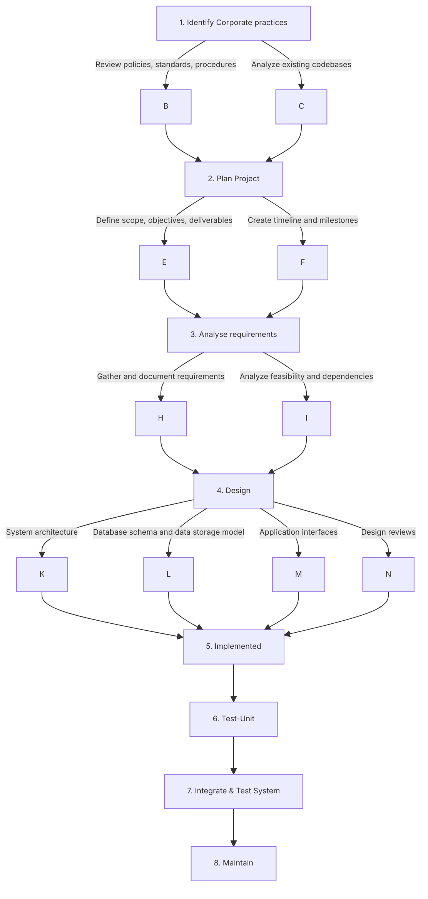

1. Identify Corporate practices
	-  **Review policies, standards, procedures:**
	-  **Analyze existing codebases:**
2. Plan Project
	-  **Define scope, objectives, deliverables**
	-  **Create timeline and milestones**
1. Analyse requirements
	-  **Gather and document requirements**
	-  **Analyze feasibility and dependencies**
1. Design
	-  **System architecture and data flow diagrams**
	-  **Database schema and data storage model**
	-  **Application interfaces**
	-  **Design reviews:**
2. Implemented
3. Test-Unit
4. Integrate & Test System
5. Maintain

